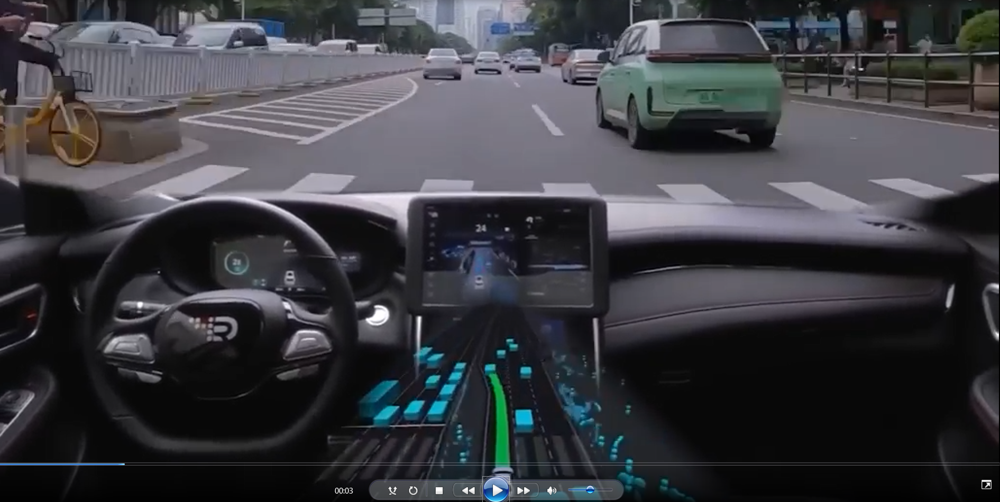
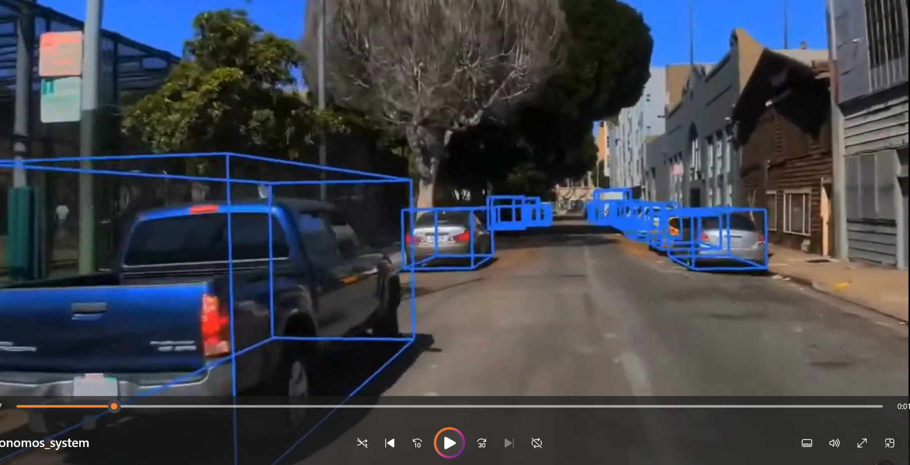

# Introduction to autonomous system

Welcome to this introductory guide on autonomous systems! Whether you're a student, professional, or enthusiast, this resource is designed to give you a foundational understanding of what autonomous systems are and how they function in the modern world.

If you're new to the field of autonomous technology, this guide will provide you with a solid starting point, covering key concepts of autonomous systems and how these systems can be integrated in the real world. If you have an interest in robotics, artificial intelligence, engineering, and emerging technologies this will be serve as a useful resource to begin your journey in autonomous field.

We hope this trainning will give you a deep understanding of the field, inspire curiosity, and prepare you to delve further into the world of autonomy.

> **No prior knowledge is required—just a curiosity about the future of intelligent systems.**

---

### About the instructor

👋 Hi! I'm **[Yousef Asal](https://github.com/Yousef-Asal)**

* 🎓 Mechatronics Level 300
* 🧠  autonomous member (SLAM) 23-24
* 🤖 Autonomous Head 24-25
* 🔗Contact me: [LinkedIn](https://www.linkedin.com/in/yousefasal/)

---

### About Trainning

⏳  Duration: 2 weeks

🔢 Number of sessions: 6

🗓 Days: Saturday, Monday, Wednesday

⏲ Time: 3.15 pm

---

### Trainning Content Overview

This training will walk you through the main building blocks of autonomous systems, explained in the following modules:

1. **Introduction to Autonomous Systems** :
   We'll start by defining autonomous systems, exploring their history, key features, and how they are transforming industries like transportation and robotics.
2. **Perception** :
   In this section, we’ll discuss how autonomous systems "see" and interpret the world around them. You’ll learn about different sensors such as cameras, LiDAR, and radar, and how these sensors gather data to form a complete picture of the environment.
3. **Simultaneous Localization and Mapping (SLAM)** :
   This module covers how autonomous systems build maps of their surroundings while figuring out their own position within that space. SLAM is essential for navigation and is used in robots, drones, and self-driving cars.
4. **Motion Planning** :
   We'll look at how systems plan their movements, taking into account obstacles and finding the most efficient path to their goal. This involves algorithms that predict future positions and make decisions in real time.
5. **Control** :
   In this section, we'll discuss how systems take their planned path and turn it into real actions. Control ensures the system adjusts its movements and stays on course despite changes in the environment.
6. **System Integration and Tools** :
   Finally, we'll explore how all the parts (perception, SLAM, planning, control) come together into a functioning system. We'll also introduce tools and frameworks like ROS (Robot Operating System) for simulation and testing.

---

### Today's Content

* **What is autonomous systems?**
* **What makes the autonomous task?**
* **Levels of autonomy**
* **Challenges facing autonomous systems**
* **Why should you study autonomous**

---

### What is autonomous systems?

> The word **"autonomous"** comes from the Greek word  *autonomos* , meaning "self-governing" or "having its own laws."

In the context of technology, **autonomous systems** are machines or software that can perform tasks or make decisions without the need for constant human control. These systems are designed to function independently, using sensors, algorithms, and control mechanisms to adapt to changing environments.

To have an idea of how autonomous systems look like let's start with and example:

**Key characteristics of autonomous systems include:**

* **👁‍🗨Perception** : Using sensors (like cameras, LiDAR, or radar), they can perceive their surroundings and collect real-time data.
* **🤷‍♂️Decision-making** : Through processing this data, they analyze situations and make decisions, often using artificial intelligence.
* **🎬Action** : Based on decisions, they can execute tasks or actions, such as moving from point A to point B or performing a specific job.
* **🚶Independence** : They can make decisions and perform tasks without constant human guidance.
* **📚Learning and Adaptability** : Advanced autonomous systems not only perform tasks based on pre-defined rules but can also learn from their experiences.

#### Autonomous VS Automatic Systems🎌

Many people mix between autonomous systems and automatic system because of the similarity of the words.

The difference between an **automatic system** and an **autonomous system** lies in the level of decision-making, adaptability, and human involvement required.

| Feature                     | Automatic System                                   | Autonomous System                                     |
| --------------------------- | -------------------------------------------------- | ----------------------------------------------------- |
| **Decision-making**   | Follows predefined rules; no real decision-making  | Analyzes data and makes decisions independently       |
| **Adaptability**      | Limited to fixed scenarios; can't handle surprises | Can adapt to changing environments and situations     |
| **Human involvement** | Requires setup and possibly intervention           | Operates with minimal or no human intervention        |
| **Technology**        | Simple mechanisms (basic sensors, timers, etc.)    | Advanced technologies (AI, machine learning, sensors) |
| **Examples**          | Automatic doors, thermostats, washing machines     | Self-driving cars, drones, robotics systems           |

---

#### Examples⭕

Here is some examples to better understand what autonomous means and why it's important:

##### **Self-driving Cars (Autonomous Vehicles)** 🚗

These vehicles can navigate roads, detect obstacles, follow traffic rules, and make decisions like lane changes or stopping at traffic signals without human intervention.

**Example** : Tesla autopilot , Waymo

##### **Drones (Unmanned Aerial Vehicles)** 🛸

Drones can fly autonomously using GPS and sensors, avoiding obstacles, following specific flight paths, and performing tasks like aerial photography, surveying, or package delivery without requiring a human pilot.

**Example** : DJI Phantom, Amazon Prime Air

##### **Robotic Vacuum Cleaners** 🤖

These home robots autonomously clean floors by mapping out rooms, detecting obstacles like furniture or stairs, and adjusting their paths. They can return to their charging stations on their own when the battery is low.

**Example** : iRobot Roomba, Neato Robotics

##### **Autonomous Ships (Unmanned Surface Vessels)** 🚢

These vessels navigate the seas autonomously, performing tasks such as patrolling, surveying, or transporting goods. They use radar, sonar, and GPS for navigation and can make decisions based on real-time sea conditions.

**Example** : Sea Hunter (DARPA project), Rolls-Royce autonomous ships

##### **Autonomous Delivery Robots** 📦

These ground-based robots deliver packages or food in urban areas. They navigate streets, avoid pedestrians, and reach specific destinations without human assistance, making deliveries efficient.

**Example** : Starship Technologies, Nuro

##### **Autonomous Spacecraft** 🚀

Spacecraft like the Mars Rover can autonomously navigate and conduct experiments on other planets. They are equipped with AI to analyze terrain, avoid hazards, and perform scientific tasks with minimal human input from Earth.

**Example** : Mars Rover (NASA), SpaceX Dragon

##### **Autonomous Submarines (Unmanned Underwater Vehicles)** 🌊

Used for underwater exploration, these submarines can navigate deep ocean environments to gather data for research, inspect underwater infrastructure, or map seabeds autonomously without needing a crew on board.

**Example** : Boeing Echo Voyager, Bluefin Robotics

##### **Autonomous Farming Equipment** 🚜

These tractors and harvesters can autonomously plow, plant, and harvest crops. Using GPS, sensors, and AI, they can operate on predefined paths or adjust their operations based on real-time data from the field, improving efficiency and precision in farming.

**Example** : John Deere Autonomous Tractor

##### **Autonomous Industrial Robots** 🏭

Used in manufacturing, these robots can assemble parts, weld, or move materials around factory floors without direct human control. They are equipped with sensors to navigate, handle objects, and avoid collisions in dynamic environments.

**Example** : KUKA Robots, ABB Robotics

#### Let's think autonomous💁

To deepen our understanding of the concept of autonomous let's take an **ordinary piece of machinary** and turn it into an **intellegent system** that is capable of thinking and making decisions on its own.

Let's look at the stove for example. Any one of us has a stove in his home and we all have used it before. So let's break down the tasks that the stove help us achieve. first it provides fire in an easy way also i can control the amount of heat and some stoves have timers that can be used to turn the heat off automaticaly after a certain period.

Now let's break down the tasks that we as humans need to do to use the stove correctly. We need to put the ingredients of our recipe in a correct order to make the food we want. We also need to keep an eye on the stove in case of any emergancies or to shut it down before the food gets burnt. we also need to change the amount of heat during differnet stages of cooking.

Finally let's use what we understood so far and try to implement our system on the stove. We start by adding some sensors to the stove to enable it to perceive the environment around it **(Perception).** after this we will develop some algorithms that can use the information we gather from the previous stage and provide us with the correct decision that should be taken **(Planning).** then we will add some actuators to perform the actions that the planning stage has ordered **(Control).** now we have a system that is capable of cooking a meal on its own **(Independence).** the final step to take our system to the next level is to make it able to learn from its mistakes **(Learning and Adaptability).**

> **Now after we understood the concept of autonomous we should be able to turn any machine into a smart thinking system.**

---

#### Why Autonomous Systems Have Gained Popularity in Recent Years📈

Autonomous systems have become a major trend due to advancements in technology, increasing demand for efficiency, and their potential to solve complex challenges.

> **The fact is autonomous systems have been around for some decades now and it's not a new concept that just appeared.**

It all started with **shakey the robot**. Developed at Stanford Research Institute (SRI), **Shakey** is often considered the first autonomous robot. Shakey could navigate its environment, make decisions, and perform simple tasks like moving objects based on sensor data, marking a significant step in autonomous robotics.

> **So since autonomous systems have been around for this long why is it trending now?**

the answer for this question can be summed up in one sentence "the advancements inn recent technologies". especially the great improvements that happened in the AI field.

##### **Advancements in AI and Machine Learning💻**

**Artificial Intelligence (AI)** and **machine learning** have made it possible for systems to analyze vast amounts of data and make decisions in real-time. AI enables autonomous systems to learn from their experiences, improving over time and adapting to new environments. This ability to evolve and become more efficient has made autonomy more feasible and reliable than ever before.

##### **Connectivity and the Internet of Things (IoT)📡**

The rise of **IoT** (Internet of Things) has enabled autonomous systems to be connected to other devices and systems. This connectivity allows them to share and process data seamlessly, improving coordination and performance. For example, autonomous vehicles can communicate with traffic systems to adjust their routes in real-time, and drones can work together to map large areas more efficiently.

##### **Improved Sensors and Sensing Technologies📷**

The development of sophisticated sensors such as  **LiDAR** ,  **radar** ,  **cameras** , and **ultrasonic sensors** has greatly improved the ability of autonomous systems to perceive and understand their environments. These sensors provide real-time data with high accuracy, allowing systems to navigate complex environments like urban streets or industrial settings.

##### **Increasing Need for Efficiency📋**

Autonomous systems are being adopted because they offer solutions to improve efficiency across various industries. In manufacturing, self-operating robots can work continuously without fatigue. In transportation, autonomous vehicles can reduce traffic accidents caused by human error and optimize routes for better fuel efficiency. These systems help reduce costs and increase productivity by automating repetitive or dangerous tasks.

##### **Environmental Impact ♻️**

Autonomous systems can play a significant role in reducing environmental impact. Autonomous vehicles, for instance, can optimize driving patterns to reduce fuel consumption and emissions. In agriculture, autonomous machines can use precision techniques to minimize the use of water, fertilizers, and pesticides, leading to more sustainable farming practices.

##### **Safety and Risk Reduction🔒**

Autonomous systems are often used in environments that are dangerous or inaccessible to humans, such as deep-sea exploration, space missions, or hazardous factory settings. They help minimize the risk to human life by performing tasks that would be too risky for people. In transportation, autonomous vehicles promise to reduce accidents by eliminating human errors, which are a leading cause of traffic collisions.

Of course these are not all the technologies driving autonomous systems forward but we just demonstrated some important points that had a great impact on developing autonomous systems.

---

### What makes the autonomous task?

Now we want to breakdown our system into some components and tasks so we can easly build our autonomous system.

So there's no one true definition for autonomous systems but it's more about the application that defines the frame of our system but we can break it down into the four key systems which must be implemented in our system in one way or another. these systems are: **Perception**, **SLAM**, **Motion Planning**, and **Control**.These components work together to allow the autonomous machine to sense its environment, understand its position, plan its movements, and execute them effectively.

To help us understand these concept let's explain them with an example. and what better example than self-driving cars.

> **Let's begin with this question what is the first thing you do after you start your car's engine?**

The answer will probably be you **look around** you and see if there is any objects, cars, or pedistrians on your way.

This step is is called **perception** and while you have **eyes** helping you doing so without you even noticing that this is a task that you should perform. we need to make the car able to **percieve the environment** like we do with our eyes.

#### **Perception**👁️

 **Definition** : Perception is how an autonomous system gathers information about its surroundings using sensors like cameras, LiDAR, and ultrasonic sensors.

 **Purpose** : The goal of perception is to create an accurate representation of the environment in real-time, enabling the system to understand obstacles, paths, and other objects.

 **Key Tasks** :

* **Object Detection** : Identifying and locating objects in the environment, such as pedestrians, vehicles, or obstacles.
* **Object Classification** : Determining what the detected objects are (e.g., recognizing whether an object is a pedestrian, a car, or a traffic sign).

---

> **Okay now what is the next step that our vehicle should perform?**

It's another task that we as human **perform naturally** without us noticing and this task is called **SLAM** whih is **mapping** the environment around us and knowing our **location** in this environment. **when you take a look around from your vehicle you perform a quick scan locating every object around you and where it is relative to you**. this is exactly what **SLAM** does in our system.

#### **SLAM (Simultaneous Localization and Mapping)** 🌍

 **Definition** : SLAM is the process where an autonomous system maps its environment while simultaneously figuring out its position within that map. SLAM helps the system "localize" itself and build a map of its surroundings at the same time.

 **Purpose** : SLAM enables the system to navigate in unknown environments by constructing a dynamic map and continuously updating its position.

 **Key Tasks** :

* **Mapping** : Creating an internal map of the environment in real-time.
* **Localization** : Determining the system’s position on the map using sensors.

---

> **So we idenified the objects in our environment, we created a map of this environment and we located our vehicle in the environment now can you guess what the next should be?**

We as humans after knowing the environment around us we will try to find the **best route** to **navigate** through this environment and this process is callled **motion planning**. in this process the vehicle doesn't only determine the **path** that it will take but also how it would follow this path and what are the **velocity** of the vehicle along this path.

#### **Motion Planning**🛣️

 **Definition** : Motion planning is the process of determining a safe and efficient path for the autonomous system to reach its goal. It involves finding routes while avoiding obstacles and adhering to movement constraints (e.g., speed, direction).

 **Purpose** : The system uses motion planning to make decisions about how and where to move, considering both the environment and the task at hand.

 **Key Tasks** :

* **Path Planning** : Determining the optimal route to a target destination.
* **Collision Avoidance** : Ensuring the path avoids obstacles.
* **Dynamic Replanning** : Adjusting the plan in real-time if new obstacles or challenges arise.

---

> **After all these steps we the vehicle is still in the start position and didn't start moving yet so the next step should be actually moving the vehicle along the path we had planned.**

After we perform all the previous steps as humans which don't take much time to perform we start **steping on the gas pedal** to move the car. this is **vehicle control** and it doesn't only control **throttle** but also **brakes**, **steering** and any other action that we perform as humans the control system should be able to **dublicate our actions.**

#### **Control**🚗

 **Definition** : Control refers to the execution of planned movements by sending commands to the machine’s actuators (e.g., motors, wheels, propellers) to make precise movements. The control system ensures the robot or vehicle follows the planned path accurately.

 **Purpose** : To transform high-level plans into physical actions, allowing the machine to move safely and effectively in the real world.

 **Key Tasks** :

* **Trajectory Control** : Ensuring that the system follows the planned route or trajectory.
* **Speed and Direction Control** : Managing the system’s speed and direction based on real-time data.
* **Stability** : Maintaining balance and avoiding unsafe movements.

---

> **Important note: the system doesn't perform these tasks consecutively but all these systems work in parallel.**

To fully understand what maked the autonomous task let's watch this video that will help us understand the concepts that we talked about.

---

### Levels of autonomy🚗🤖

Autonomous systems are not all created equal—they vary in their **level of independence** from human intervention. The **levels of autonomy** are a way to categorize these systems based on **how much control the machine has versus how much oversight or input is required from a human operator.**

Understanding these levels is crucial because it helps set expectations for safety, performance, and regulation. Whether we're discussing autonomous vehicles, drones, or robotic systems, these levels help **define the system's capabilities and limitations**.

---

#### **Why Levels of Autonomy Matter** 📊

Defining levels of autonomy helps:

* **Standardize Development** : Engineers and developers use these levels to benchmark their systems and communicate clearly about their capabilities.
* **Set User Expectations** : It informs users about how much they need to be involved in operating the system, which affects safety and convenience.

---

#### **Criteria for Defining Levels of Autonomy** 🎯

When categorizing the level of autonomy, we consider:

* **Human Involvement** : How much the human operator is required to monitor or control the system.
* **Environmental Awareness** : How well the system perceives and understands its surroundings.
* **Task Complexity** : The types of tasks the system can perform autonomously, such as driving, navigating, or operating machinery.
* **Decision-Making** : Whether the system can make decisions on its own or needs human guidance.

These criteria help differentiate between the six levels of autonomy, which range from **no automation** to  **full automation** .

---

#### **The Six Levels of Autonomy** 📈

1. **Level 0: No Automation**
   * **Human Involvement** : Full control by a human.
   * **Example** : Traditional cars without any driver assistance systems.
2. **Level 1: Driver Assistance**
   * **Human Involvement** : The driver is in control but gets assistance with a single task (like steering or braking).
   * **Example** : Cruise control or lane-keeping assist.
3. **Level 2: Partial Automation**
   * **Human Involvement** : The system can control both steering and speed, but the human must monitor and take over if needed.
   * **Example** : Tesla's Autopilot with adaptive cruise control.
4. **Level 3: Conditional Automation**
   * **Human Involvement** : The system can take over in certain conditions, but the human must intervene when requested.
   * **Example** : Automated highway driving systems.
5. **Level 4: High Automation**
   * **Human Involvement** : The system handles all tasks within specific conditions (e.g., geofenced areas) without human input.
   * **Example** : Autonomous taxis operating in restricted zones.
6. **Level 5: Full Automation**
   * **Human Involvement** : No human input required, the system is completely autonomous in any environment.
   * **Example** : Fully autonomous vehicles that can drive anywhere without human oversight.

---

#### **Quiz: Classify the Level of Autonomy** 🎓❓

**Situation 1** : You are driving a car on the highway. The car can maintain its speed and stay within the lane without any input from you, but you still need to keep your hands on the wheel and be ready to take over.

**Situation 2** : A delivery robot is navigating a busy warehouse, picking up items and avoiding obstacles. It doesn’t need any human guidance but only operates within the warehouse.

---

### Challenges facing autonomous systems

Autonomous systems have the potential to revolutionize industries ranging from transportation to healthcare. However, developing and deploying these systems comes with significant challenges. These challenges span technical, social, ethical, and legal domains, and they must be addressed to ensure that autonomous systems are safe, reliable, and beneficial to society. In this section, we will explore some of the major hurdles faced by autonomous systems, from sensor limitations to ethical dilemmas.

---

#### **1. Sensor Limitations** 📡

Autonomous systems rely heavily on sensors like cameras, LiDAR, radar, and ultrasonic sensors to perceive their surroundings. While these sensors have advanced, they still face several limitations:

* **Environmental Sensitivity** : Sensors can struggle in adverse weather conditions like heavy rain, fog, or snow, which can block cameras and scatter LiDAR signals. This can result in the system being "blind" or less accurate.
* **Limited Range and Resolution** : Many sensors have restricted ranges or resolutions. For example, radar may detect distant objects but struggle with detail, while cameras can capture fine details but have limited range, especially in low light.
* **Data Fusion Complexity** : Autonomous systems often combine data from multiple sensors (sensor fusion) to create an accurate view of the environment. This process is complex and prone to errors if the data from different sensors don't align perfectly, leading to inconsistencies in decision-making.

---

#### **2. Data Processing and Real-Time Decision-Making** 💻⏳

Autonomous systems generate vast amounts of data in real time, which must be processed quickly to make timely decisions. This presents several challenges:

* **Massive Data Volumes** : Sensors constantly generate huge volumes of data, especially in environments like city streets. Processing this data in real time requires significant computing power and efficient algorithms.
* **Latency** : Delays in processing or transmitting data can cause the system to react too slowly to changing situations, which can lead to accidents or system failures. Reducing latency in decision-making is critical.
* **Complex Environments** : The system must navigate dynamic and unpredictable environments. Whether it's detecting a pedestrian crossing the street or avoiding an obstacle in a factory, the system needs to interpret the data and act almost instantaneously.

---

#### **3. Urban Infrastructure Adaptation** 🏙️

Autonomous systems, especially vehicles, rely on more than just onboard technology; they need urban infrastructure that can support them:

* **Smart Infrastructure** : Autonomous vehicles may require smart traffic signals, specialized lanes, and communication systems that allow vehicles to “talk” to the surrounding infrastructure. Cities will need to adapt to accommodate these systems.
* **Road Quality and Markings** : Many autonomous systems depend on clear road markings, signs, and consistent infrastructure. In areas with poor infrastructure or unclear road conditions, autonomous systems may struggle to navigate safely.

---

#### **4. Ethical and Legal Challenges** ⚖️

The rise of autonomous systems brings up numerous ethical and legal questions that must be addressed before these systems can be widely adopted:

* **Ethical Decision-Making** : In critical situations (e.g., a potential collision), autonomous systems may face ethical dilemmas about how to prioritize safety. Should the system prioritize the safety of passengers or pedestrians? These are difficult questions that need careful consideration in system design.
* **Accountability and Legal Liability** : When an autonomous system causes harm or fails, determining who is responsible becomes a complex legal issue. Is it the manufacturer, the operator, or the software developer? Legal frameworks need to evolve to address these questions.
* **Privacy Concerns** : Autonomous systems often collect large amounts of data about their environment, which can include personal information about individuals (e.g., video footage of pedestrians). Ensuring privacy while gathering necessary data is a critical ethical concern.

> **Who you think is responsible if an autonomous system fails and causes harm?**
> a) The person who buys the system
> b) The system operator only
> c) The developer who made the system
> d) The Manufacturer

---

### Why should you study autonomous?🤖

Ok let's end this demonstration with an important question. why should you study autonomous. we'll assume that most people reading this document are in **mechatronics, computer science engineering** or any other field that is related to programming and software. so why should be interested in this field. one word for this which is **opportunities.** Autonomous field is not as popular such as **embedded systems or web development** for example and that's because it's still developing and it's kinda hard and takes a good amount of time to get comfortable with. but if you there's no better time than now to start getting in the field.

and for people who are sceptecal here's some companies that work in autonomous systems either in robotics or self-driving cars:

#### **International Companies** 🌍

1. **Tesla**
2. **Waymo**
3. **Cruise**
4. **Boston Dynamics**
5. **Uber ATG**
6. **NVIDIA**
7. **Amazon Robotics**
8. **Zoox**
9. **Baidu Apollo**
10. **Blue River Technology**

before the ending talk about the github and recording the sessions

#### **Egyptian Companies** 🇪🇬

1. **Robusta**
2. **KarmSolar**
3. **Silicon Waha**
4. **Sewedy Robotics**
5. **Valeo**
6. **AvidBeam**
7. **Synapse Analytics**

---

### **Resources** 📚

To deepen your understanding and explore more about autonomous systems, here are some valuable resources:

[Autonomous navigation](https://youtube.com/playlist?list=PLn8PRpmsu08rLRGrnF-S6TyGrmcA2X7kg&si=tiDhsz0EWVWz95IR) - mathworks - playlist

[F1 TENTH](https://f1tenth.org/learn.html) - F1TENTH - course

[Probabilistic Robotics](https://docs.ufpr.br/~danielsantos/ProbabilisticRobotics.pdf) - book

[Introduction to self-driving cars](https://www.udacity.com/course/intro-to-self-driving-cars--nd113) - udacity - nano degree

---

### **Have Questions? Reach Out!** ✉️

If you have any questions or need further clarification about anything in this documentation, feel free to get in touch. We're here to help you on your journey into the world of autonomous systems!

You can contact us at:

📧  **Email** : mmsautonomousteam@gmail.com

🌐  **GitHub Issues** : [github](https://github.com/MMSAutonomousTeam/Autonomous-Sessions/issues)

We're excited to support you and look forward to your questions! 😊
