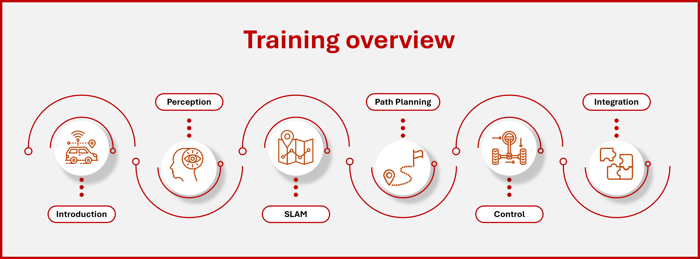
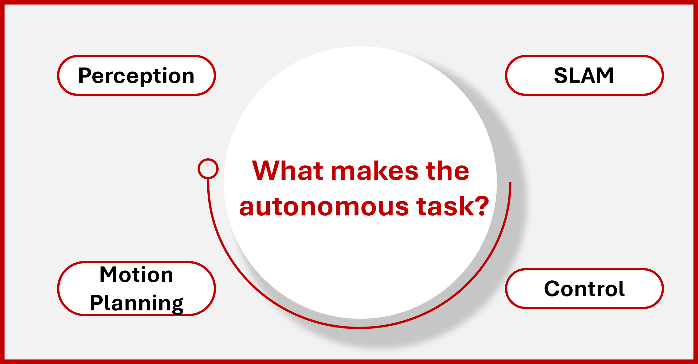

# Introduction to autonomous system

Welcome to this introductory guide on autonomous systems! Whether you're a student, professional, or enthusiast, this resource is designed to give you a foundational understanding of what autonomous systems are and how they function in the modern world.

If you're new to the field of autonomous technology, this guide will provide you with a solid starting point, covering key concepts of autonomous systems and how these systems can be integrated in the real world. If you have an interest in robotics, artificial intelligence, engineering, and emerging technologies this will be serve as a useful resource to begin your journey in autonomous field.

We hope this trainning will give you a deep understanding of the field, inspire curiosity, and prepare you to delve further into the world of autonomy.

> **No prior knowledge is required—just a curiosity about the future of intelligent systems.**

---

### About the instructor

👋 Hi! I'm **Yousef Asal**

* 🎓 Mechatronics Level 300
* 🧠  autonomous member (SLAM) 23-24
* 🤖 Autonomous Head 24-25

---

### About Trainning

⏳  Duration: 2 weeks

🔢 Number of sessions: 6

🗓 Days:

⏲ Time:

---

### Trainning Content Overview

This training will walk you through the main building blocks of autonomous systems, explained in the following modules:

1. **Introduction to Autonomous Systems** :
   We'll start by defining autonomous systems, exploring their history, key features, and how they are transforming industries like transportation and robotics.
2. **Perception** :
   In this section, we’ll discuss how autonomous systems "see" and interpret the world around them. You’ll learn about different sensors such as cameras, LiDAR, and radar, and how these sensors gather data to form a complete picture of the environment.
3. **Simultaneous Localization and Mapping (SLAM)** :
   This module covers how autonomous systems build maps of their surroundings while figuring out their own position within that space. SLAM is essential for navigation and is used in robots, drones, and self-driving cars.
4. **Motion Planning** :
   We’ll look at how systems plan their movements, taking into account obstacles and finding the most efficient path to their goal. This involves algorithms that predict future positions and make decisions in real time.
5. **Control** :
   In this section, we'll discuss how systems take their planned path and turn it into real actions. Control ensures the system adjusts its movements and stays on course despite changes in the environment.
6. **System Integration and Tools** :
   Finally, we'll explore how all the parts (perception, SLAM, planning, control) come together into a functioning system. We'll also introduce tools and frameworks like ROS (Robot Operating System) and Gazebo for simulation and testing.

---

### Today's Content

* **What is autonomous systems?**
* **What makes the autonomous task?**
* **Levels of autonomy**
* **Challenges facing autonomous systems**
* **Why should you study autonomous**

---

### What is autonomous systems?

> The word **"autonomous"** comes from the Greek word  *autonomos* , meaning "self-governing" or "having its own laws."

In the context of technology, **autonomous systems** are machines or software that can perform tasks or make decisions without the need for constant human control. These systems are designed to function independently, using sensors, algorithms, and control mechanisms to adapt to changing environments.

To have an idea of how autonomous systems look like let's start with and example:

**Video goes hereeeeeeeeeeeee**

**Key characteristics of autonomous systems include:**

* **👁‍🗨Perception** : Using sensors (like cameras, LiDAR, or radar), they can perceive their surroundings and collect real-time data.
* **🤷‍♂️Decision-making** : Through processing this data, they analyze situations and make decisions, often using artificial intelligence.
* **🎬Action** : Based on decisions, they can execute tasks or actions, such as moving from point A to point B or performing a specific job.
* **🚶Independence** : They can make decisions and perform tasks without constant human guidance.
* **📚Learning and Adaptability** : Advanced autonomous systems not only perform tasks based on pre-defined rules but can also learn from their experiences.

#### Autonomous VS Automatic Systems🎌

Many people mix between autonomous systems and automatic system because of the similarity of the words.

The difference between an **automatic system** and an **autonomous system** lies in the level of decision-making, adaptability, and human involvement required.

| Feature                     | Automatic System                                   | Autonomous System                                     |
| --------------------------- | -------------------------------------------------- | ----------------------------------------------------- |
| **Decision-making**   | Follows predefined rules; no real decision-making  | Analyzes data and makes decisions independently       |
| **Adaptability**      | Limited to fixed scenarios; can't handle surprises | Can adapt to changing environments and situations     |
| **Human involvement** | Requires setup and possibly intervention           | Operates with minimal or no human intervention        |
| **Technology**        | Simple mechanisms (basic sensors, timers, etc.)    | Advanced technologies (AI, machine learning, sensors) |
| **Examples**          | Automatic doors, thermostats, washing machines     | Self-driving cars, drones, robotics systems           |

---

#### Examples⭕

Here is some examples to better understand what autonomous means and why it's important:

##### **Self-driving Cars (Autonomous Vehicles)** 🚗

These vehicles can navigate roads, detect obstacles, follow traffic rules, and make decisions like lane changes or stopping at traffic signals without human intervention.

**Example** : Tesla autopilot , Waymo

##### **Drones (Unmanned Aerial Vehicles)** 🛸

Drones can fly autonomously using GPS and sensors, avoiding obstacles, following specific flight paths, and performing tasks like aerial photography, surveying, or package delivery without requiring a human pilot.

**Example** : DJI Phantom, Amazon Prime Air

##### **Robotic Vacuum Cleaners** 🤖

These home robots autonomously clean floors by mapping out rooms, detecting obstacles like furniture or stairs, and adjusting their paths. They can return to their charging stations on their own when the battery is low.

**Example** : iRobot Roomba, Neato Robotics

##### **Autonomous Ships (Unmanned Surface Vessels)** 🚢

These vessels navigate the seas autonomously, performing tasks such as patrolling, surveying, or transporting goods. They use radar, sonar, and GPS for navigation and can make decisions based on real-time sea conditions.

**Example** : Sea Hunter (DARPA project), Rolls-Royce autonomous ships

##### **Autonomous Delivery Robots** 📦

These ground-based robots deliver packages or food in urban areas. They navigate streets, avoid pedestrians, and reach specific destinations without human assistance, making deliveries efficient.

**Example** : Starship Technologies, Nuro

##### **Autonomous Spacecraft** 🚀

Spacecraft like the Mars Rover can autonomously navigate and conduct experiments on other planets. They are equipped with AI to analyze terrain, avoid hazards, and perform scientific tasks with minimal human input from Earth.

**Example** : Mars Rover (NASA), SpaceX Dragon

##### **Autonomous Submarines (Unmanned Underwater Vehicles)** 🌊

Used for underwater exploration, these submarines can navigate deep ocean environments to gather data for research, inspect underwater infrastructure, or map seabeds autonomously without needing a crew on board.

**Example** : Boeing Echo Voyager, Bluefin Robotics

##### **Autonomous Farming Equipment** 🚜

These tractors and harvesters can autonomously plow, plant, and harvest crops. Using GPS, sensors, and AI, they can operate on predefined paths or adjust their operations based on real-time data from the field, improving efficiency and precision in farming.

**Example** : John Deere Autonomous Tractor

##### **Autonomous Industrial Robots** 🏭

Used in manufacturing, these robots can assemble parts, weld, or move materials around factory floors without direct human control. They are equipped with sensors to navigate, handle objects, and avoid collisions in dynamic environments.

**Example** : KUKA Robots, ABB Robotics

#### Let's think autonomous💁

To deepen our understanding of the concept of autonomous let's take an ordinary piece of machinary and turn it into an intellegent system that is capable of thinking and making decisions on its own.

Let's look at the stove for example. Any one of us has a stove in his home and we all have used it before. So let's break down the tasks that the stove help us achieve. first it provides fire in an easy way also i can control the amount of heat and some stoves have timers that can be used to turn the heat off automaticaly after a certain period.

Now let's break down the tasks that we as humans need to do to use the stove correctly. We need to put the ingredients of our recipe in a correct order to make the food we want. We also need to keep an eye on the stove in case of any emergancies or to shut it down before the food gets burnt. we also need to change the amount of heat during differnet stages of cooking.

Finally let's use what we understood so far and try to implement our system on the stove. We start by adding some sensors to the stove to enable it to perceive the environment around it **(Perception).** after this we will develop some algorithms that can use the information we gather from the previous stage and provide us with the correct decision that should be taken **(Planning).** then we will add some actuators to perform the actions that the planning stage has ordered **(Control).** now we have a system that is capable of cooking a meal on its own **(Independence).** the final step to take our system to the next level is to make it able to learn from its mistakes **(Learning and Adaptability).**

> **Now after we understood the concept of autonomous we should be able to turn any machine into a smart thinking system.**

---

#### Why Autonomous Systems Have Gained Popularity in Recent Years📈

Autonomous systems have become a major trend due to advancements in technology, increasing demand for efficiency, and their potential to solve complex challenges.

> **The fact is autonomous systems have been around for some decades now and it's not a new concept that just appeared.**

It all started with **shakey the robot**. Developed at Stanford Research Institute (SRI), **Shakey** is often considered the first autonomous robot. Shakey could navigate its environment, make decisions, and perform simple tasks like moving objects based on sensor data, marking a significant step in autonomous robotics.
                                              

###### **So since autonomous systems have been around for this long why is it trending now?**

the answer for this question can be summed up in one sentence "the advancements inn recent technologies". especially the great improvements that happened in the AI field.

#### **Advancements in AI and Machine Learning💻**

**Artificial Intelligence (AI)** and **machine learning** have made it possible for systems to analyze vast amounts of data and make decisions in real-time. AI enables autonomous systems to learn from their experiences, improving over time and adapting to new environments. This ability to evolve and become more efficient has made autonomy more feasible and reliable than ever before.

#### **Connectivity and the Internet of Things (IoT)📡**

The rise of **IoT** (Internet of Things) has enabled autonomous systems to be connected to other devices and systems. This connectivity allows them to share and process data seamlessly, improving coordination and performance. For example, autonomous vehicles can communicate with traffic systems to adjust their routes in real-time, and drones can work together to map large areas more efficiently.

#### **Improved Sensors and Sensing Technologies📷**

The development of sophisticated sensors such as  **LiDAR** ,  **radar** ,  **cameras** , and **ultrasonic sensors** has greatly improved the ability of autonomous systems to perceive and understand their environments. These sensors provide real-time data with high accuracy, allowing systems to navigate complex environments like urban streets or industrial settings.

#### **Increasing Need for Efficiency📋**

Autonomous systems are being adopted because they offer solutions to improve efficiency across various industries. In manufacturing, self-operating robots can work continuously without fatigue. In transportation, autonomous vehicles can reduce traffic accidents caused by human error and optimize routes for better fuel efficiency. These systems help reduce costs and increase productivity by automating repetitive or dangerous tasks.

#### **Environmental Impact ♻️**

Autonomous systems can play a significant role in reducing environmental impact. Autonomous vehicles, for instance, can optimize driving patterns to reduce fuel consumption and emissions. In agriculture, autonomous machines can use precision techniques to minimize the use of water, fertilizers, and pesticides, leading to more sustainable farming practices.

#### **Safety and Risk Reduction🔒**

Autonomous systems are often used in environments that are dangerous or inaccessible to humans, such as deep-sea exploration, space missions, or hazardous factory settings. They help minimize the risk to human life by performing tasks that would be too risky for people. In transportation, autonomous vehicles promise to reduce accidents by eliminating human errors, which are a leading cause of traffic collisions.

Of course these are not all the technologies driving autonomous systems forward but we just demonstrated some important points that had a great impact on developing autonomous systems.

### What makes the autonomous task?

### Levels of autonomy

### Challenges facing autonomous systems

ethical challenges

### Why should you study autonomous

before the ending talk about the github and recording the sessions

we will neded to add a section in the main readme saynig that this was for an offline training and not designed originally for broad learning

so there will be some info targeting our attendees
