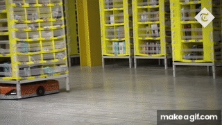

# Introduction to autonomous system

Welcome to this introductory guide on autonomous systems! Whether you're a student, professional, or enthusiast, this resource is designed to give you a foundational understanding of what autonomous systems are and how they function in the modern world.

If you're new to the field of autonomous technology, this guide will provide you with a solid starting point, covering key concepts of autonomous systems and how these systems can be integrated in the real world. If you have an interest in robotics, artificial intelligence, engineering, and emerging technologies this will be serve as a useful resource to begin your journey in autonomous field.

We hope this trainning will give you a deep understanding of the field, inspire curiosity, and prepare you to delve further into the world of autonomy.

> **No prior knowledge is required—just a curiosity about the future of intelligent systems.**

---

# About the instructor

👋 Hi! I'm **Omar Ashraf**

* 🎓 Mechatronics Level 300
* 🧠  autonomous member (SLAM)

# Today's Content

* **What is SLAM?**
* **Sensors**
* **SLAM equation**
* **Types of localization & mapping**
* **Challenges facing SLAM**
* **SLAM approaches**
* **Applications**

# Intro to SLAM?

**What is SLAM?**

- SLAM stands for simultaneous localization and mapping.

**What is localization and mapping?**

- Localization: Localization refers to the estimated poses of the robot. It contains the robot’s position and orientation at different time steps. These poses are typically represented as (x, y, theta)
- Mapping: Mapping refers to the estimated positions of the landmarks in the environment. Landmarks are distinct features in the environment that the robot can perceive, such as walls, corners, or objects.
- Landmarks: Landmarks are distinct features or points of interest in the environment that the robot can perceive. They can be objects, corners, walls, or any other feature that the robot can use to navigate and localize itself. Landmarks serve as reference points for the robot’s position estimation.
- Odometry: is the process of using data from motion sensors (such as wheel encoders, gyroscopes, or accelerometers) to estimate changes in position over time.Although odometry provides a basic estimate of position, it is prone to errors that accumulate over time, such as wheel slip or sensor drift. Therefore, it is often complemented by other sensors to improve accuracy.

**What is the goal of SLAM?**

- The main goal of SLAM is for a robot to navigate and explore an unknown environment, create a map of that environment, and at the same time, determine its position within that map. This is done in real-time, without prior knowledge of the environment.

**Why is SLAM important for autonomous systems?**

- SLAM is critical for autonomous navigation in environments where pre-existing maps aren't available. It enables a robot to understand its surroundings and move through them without human guidance, which is essential for tasks like autonomous driving, robotic exploration, and drone navigation.

# **SENSORS**

### Encoder:

is a device used to convert motion such as rotation into an electrical signal, which can then be interpreted by a control system. It is commonly used in robotics, automation, and machinery to track position, speed, or direction of movement.

**How encoder works?**

A rotary encoder is attached to a rotating shaft, and it detects the angle or speed of rotation.

 A disc with evenly spaced slots or markings (often opaque and transparent sections) rotates between a light source and a photo-detector.

* As the disc spins, the detector reads light pulses (on/off) as the slots or markings pass by.
* Each pulse represents a unit of movement. By counting these pulses, the system can determine the relative position and speed.
* The system tracks how many pulses have occurred to measure rotation, but it doesn't know the exact position after powering off unless re-calibrated.

### **LIDAR:**

wavelength is mainly located in the near-infrared part of the electromagnetic spectrum (750 nm to 1.5µm)

LIDAR—which is short for Light Detection and Ranging—uses a laser that is emitted and then received back in the sensor. In most of the LIDAR sensors used for mapping (and self driving vehicles) the time between the emission and reception is computed to determine the time of flight (ToF). Knowing the speed of light and (1/2 of the) time for the wave to return (since the signal traveled out and back) we can compute how far away the object was that caused the light to bounce back. That value is the range information that is reported by the sensor. LIDAR’s generally use light in the near-infrared, visible (but not really visible), and UV spectrum’s.

There are some sensors that use triangulation to compute the position (instead of ToF). These are usually high accuracy, high resolution sensors. These sensors are great for verifying components on an assembly lines or inspecting thermal tile damage on the space shuttle. However that is not the focus of this post.

The laser beam can also be focused to have a small spot size that does not expand much. This small spot size can help give a high resolution. If you have a spinning mirror (which is often the case) then you can shoot the laser every degree or so (based on the accuracy of the pointing mechanism) for improved resolution. It is not uncommon to find LIDAR’s operating at 0.25 degrees of angular resolution.

### RADAR:

RADAR—which is short for Radio Detection and Ranging—uses radio waves to compute velocity, and/or range to an object. Radio waves have less absorption (so less attenuation) than the light waves when contacting objects, so they can work over a longer distance. As you can see in the image below the RF waves have a larger wavelength than the LIDAR waves. The down side is that if an object is much smaller than the RF wave being used, the object might not reflect back enough energy to be detected. For that reason many RADAR’s in use for obstacle detection will be “high frequency” so that the wavelength is shorter (hence why we often use mm-wave in robotics) and can detect smaller objects. However, since LIDAR’s have the significantly smaller wavelength, they will still usually have a finer resolution.

### IMU:

An inertial measurement unit is a combination of sensors that are used to measure the orientation and motion of the robot with respect to the inertial reference frame

gyroscope:It is used to measure the orientation angles and also angel rotation rate like how fast the robot rotates (rad or deg/s)

Accelerometer :Electromechanical device that converts mechanical forces such as motion, vibration and shock to an electric signal can be measured or recorded

### GNSS:

GPS & GNSS

**diff. Between GPS & GNSS:**

* GPS (Global Positioning System): It is a specific global navigation satellite system (GNSS) developed and operated by the United States Department of Defense. GPS provides location and timing information globally and is the most well-known GNSS.
* GNSS (Global Navigation Satellite System): It is a broader term that encompasses all satellite-based navigation systems, including GPS. GNSS refers to the entire constellation of satellite systems from different countries that provide global or regional positioning services.

**Combining GNSS with SLAM:**

* GNSS-SLAM Fusion: Autonomous systems often use sensor fusion to combine GNSS data with SLAM algorithms. GNSS provides an approximate global position, while SLAM refines the vehicle's position using sensor data such as cameras, LiDAR, or radar to create detailed local maps. This fusion provides both global and local positioning accuracy.
  * For example, in outdoor autonomous driving, GNSS gives a rough idea of where the car is in the world, while SLAM refines the vehicle’s exact position relative to nearby landmarks, lanes, and obstacles.
  * In environments where GNSS signal is weak or unavailable (like urban canyons or tunnels), SLAM can continue to provide accurate localization.

**Benefits of GNSS in SLAM:**

* Global Reference: GNSS offers a reliable global reference, which can help correct long-term drift in SLAM-based systems. Over time, SLAM systems accumulate small errors, but GNSS can reset or constrain the position estimate to reduce these drifts.
* Redundant Localization: If the SLAM system faces challenges (e.g., sensor occlusions, poor lighting conditions for visual SLAM, or feature-poor environments), GNSS can provide basic fallback localization to prevent the system from getting lost.

**Challenges of Using GNSS in SLAM:**

* GNSS Limitations: GNSS is not always reliable, especially in indoor environments, tunnels, underground locations, or dense urban areas where signals can be obstructed or reflected (multipath errors). In these environments, SLAM becomes more important for maintaining localization.

- Low Precision: GNSS typically offers positioning with an accuracy of 3–10 meters. However, SLAM systems can provide much finer localization (down to centimeters) using local environmental features. Autonomous systems must fuse GNSS with SLAM for high-precision navigation.

# **Ranges&sensor of fusion:Why are we combining sensors?**

### Ranges:

**Cameras** – Range up to 30 meters, commonly used in visual SLAM for detecting features in the environment.

**Ultrasonic Sensors** – Range between 2 to 5 meters, mainly used for detecting nearby objects(parking).

**LiDAR** – Range up to 200 meters, providing precise 3D mapping of surroundings by emitting laser pulses.

**Radar** - typically has a long detection range, often up to 300 meters or more, depending on the system.

**IMUs (Inertial Measurement Units)** – Provide motion and orientation data rather than distance, useful for tracking movement and orientation.

### Sensor of fusion:

**Select Sensors:**

* Choose the appropriate sensors based on the application requirements (e.g., cameras, LiDAR, IMUs, GPS).

**Data Collection:**

* Gather data from the selected sensors during the operation of the autonomous system.

**Preprocessing:**

* Process the raw data from each sensor to remove noise, filter out irrelevant information, and normalize data formats for consistency.

**Data Association:**

* Match features detected in the environment across different sensor modalities to establish correspondences.

**State Estimation:**

* Use algorithms such as Kalman filters, extended Kalman filters (EKF), or particle filters to estimate the state of the system (position, orientation) by fusing data from the sensors.

**Mapping:**

* Update the map based on the fused data, incorporating the features detected and the estimated state of the system.

### Advantages of Using Sensor Fusion in SLAM:

**Improved Accuracy:**

* Combining data from multiple sensors reduces the uncertainty associated with individual sensors, leading to more accurate localization and mapping.

**Reliability:**

* If one sensor fails or provides unreliable data, others can compensate, making the system more resilient to sensor failures or environmental challenges.

**Enhanced Environmental Understanding:**

* Different sensors provide complementary information (e.g., LiDAR for distance and cameras for texture), leading to a richer understanding of the environment.

**Better Feature Detection:**

* Sensor fusion allows for improved detection of features and landmarks, as visual data can be enhanced with depth information from other sensors.

**Real-time Performance:**

* With efficient algorithms, sensor fusion can allow for real-time processing, making it suitable for dynamic environments.

# SLAM equation:

    ***P(X0:T, M∣Z1:T, U1:T)***

Given: Z, U

Wanted: M, X

Components of the Expression

M:

* This represents the map of the environment. It includes the features or landmarks identified by the robot during its exploration.

X:

* This denotes the state of the robot (its pose, including position and orientation).

Z:

* This is the set of observations (sensor measurements) collected. These observations help the robot understand its surroundings and refine its map.

U:

* This refers to the set of control inputs (movements or commands) applied. These inputs influence the robot's trajectory and how it updates its position.

### what is the point of equation of slam?

1. **Estimation of State and Map:**

* SLAM equations help estimate the robot's current state (pose) and the map of the environment simultaneously. This dual estimation is essential for autonomous navigation.

2. **Incorporation of Measurements and Controls:**

* The equations allow the integration of sensor measurements (like distance or visual data) and control inputs (like movements or turns). This integration is fundamental for updating the robot's beliefs about its position and the environment.

3. **Handling Uncertainty:**

* SLAM involves dealing with uncertainties in sensor readings and motion. The equations incorporate probabilistic models (like Gaussian distributions) to manage this uncertainty, improving the reliability of the state and map estimates.

4. **Real-time Processing:**

* SLAM equations are designed for efficient computation, enabling real-time processing of data. This is crucial for applications where the robot must navigate dynamic environments.

**Summary**

In essence, the equations of SLAM are central to enabling robots to map their environments and localize themselves within that map. They provide a structured way to combine various data sources, handle uncertainties, and ensure that the robot's understanding improves as it explores and interacts with its surroundings.

# Types of localization and mapping

### Localization:

**1. Global Localization**

* **Definition** : Determines the robot's position in an unknown environment without prior information.
* **How it Works** :
* The robot uses sensor data (e.g., from cameras or LIDAR) to identify features in the environment.
* It compares these features to a map or database of known features to determine its position.
* **Approaches** :
* **Monte Carlo Localization (MCL)** : Uses a set of particles to represent possible states and updates them based on sensor data.
* **Visual Recognition** : Matches visual features against a known map.
* **Example** : A robot entering a new room uses visual landmarks to identify its location.

**2. Relative Localization**

* **Definition** : Estimates the robot’s position based on its last known position, tracking movement over time.
* **How it Works** :
* The robot calculates its new position based on previous position estimates and control inputs (like wheel rotations).
* It integrates this data with sensor readings to correct any drift.
* **Approaches** :
* **Odometry** : Uses wheel encoders or IMU data to estimate movement.
* **Dead Reckoning** : Continuously calculates the current position based on previous positions.
* **Example** : A robot navigating a corridor updates its position using odometry data.

**3. Pose Estimation**

* **Definition** : Calculates the robot's position and orientation (pose) at any given time.
* **How it Works** :
* Combines sensor measurements (like LIDAR and camera data) to compute the robot's pose.
* Uses filters or optimization techniques to minimize errors.
* **Approaches** :
* **Extended Kalman Filter (EKF)** : A statistical method for state estimation, handling noise in measurements.
* **Graph-Based Optimization** : Uses a graph structure to optimize poses over time.
* **Example** : A robot estimates its pose using IMU and LIDAR data.

**4. Feature-Based Localization**

* **Definition** : Relies on identifying distinct features in the environment for localization.
* **How it Works** :
* The robot detects features using algorithms and builds a feature map.
* It compares current observations to this map to determine its location.
* **Approaches** :
* **Keypoint Detection** : Algorithms like SIFT, SURF, or ORB detect and describe features.
* **Descriptor Matching** : Matches detected features to a database of known features.
* **Example** : A robot identifies and matches visual features to determine its location.

**5. Grid-Based Localization**

* **Definition** : Divides the environment into a grid and estimates the robot's position based on sensor data.
* **How it Works** :
* Updates a grid of cells where each cell's probability of being occupied is adjusted based on sensor readings.
* The robot estimates its position by analyzing the grid's occupancy.
* **Approaches** :
* **Occupancy Grid Mapping** : Updates cell probabilities based on sensor data.
* **Particle Filters** : Uses particles to represent position estimates on the grid.
* **Example** : A robot uses an occupancy grid to localize itself in a mapped environment.

**6. Map-Based Localization**

* **Definition** : Uses a pre-existing map of the environment to determine the robot's location.
* **How it Works** :
* Compares real-time sensor data to a stored map.
* Finds the best match between current readings and map features.
* **Approaches** :
* **Template Matching** : Compares current sensor data against a known map.
* **Likelihood Fields** : Computes probabilities based on expected sensor readings.
* **Example** : A robot uses GPS and a digital map to navigate through an outdoor environment.

**7. Visual Localization**

* **Definition** : Utilizes camera data to identify features and match them to a map for localization.
* **How it Works** :
* Analyzes image frames to detect features.
* Matches these features to a pre-existing map to estimate the robot's position.
* **Approaches** :
* **Visual Odometry** : Estimates motion from consecutive camera frames.
* **Structure from Motion (SfM)** : Builds a 3D model from 2D images while estimating camera positions.
* **Example** : A drone uses visual features from its camera feed to determine its location.

**8. LIDAR-Based Localization**

* **Definition** : Relies on LIDAR data to create a point cloud of the environment and localize within it.
* **How it Works** :
* The robot scans its surroundings with LIDAR, creating a point cloud.
* It aligns this point cloud with a pre-existing map to find its position.
* **Approaches** :
* **Scan Matching** : Aligns consecutive scans using techniques like Iterative Closest Point (ICP).
* **Map Comparison** : Compares real-time scans against a pre-built map.
* **Example** : An autonomous vehicle uses LIDAR to navigate by matching scanned data to a known map.

### Mapping:

**1. Occupancy Grid Mapping**

* **Definition** : Represents the environment as a grid where each cell indicates whether it is occupied, free, or unknown.
* **How it Works** :
* Each cell's occupancy is updated based on sensor readings, which are processed to infer occupancy probabilities.
* The robot continually refines the grid as it gathers more sensor data.
* **Approaches** :
* **Bayesian Updating** : Updates probabilities based on new information.
* **Markov Localization** : Combines sensor data with a probabilistic model.
* **Example** : A robot creates a grid map marking walls and obstacles as it explores.

**2. Feature-Based Mapping**

* **Definition** : Creates a map based on identifiable features in the environment.
* **How it Works** :
* Detects features during exploration and records their positions relative to the robot.
* Constructs a feature map that can be used for localization and navigation.
* **Approaches** :
* **SLAM Algorithms** : Such as FastSLAM, which combines particle filters with feature extraction.
* **Feature Matching** : Compares detected features to build the map.
* **Example** : A robot maps a factory floor using identified shelves and machines.

**3. Dense Mapping**

* **Definition** : Produces a detailed representation of the environment, often in 3D.
* **How it Works** :
* Uses depth data from sensors to create a dense point cloud or surface model.
* Integrates information from multiple views to enhance the map's detail.
* **Approaches** :
* **Stereo Vision** : Uses two cameras for depth perception.
* **RGB-D Mapping** : Combines RGB images with depth data from sensors like Kinect.
* **Example** : A robot generates a 3D model of a room using depth data from stereo cameras.

**4. Semantic Mapping**

* **Definition** : Enhances maps with context or meaning, identifying objects or areas.
* **How it Works** :
* Uses machine learning to classify and label objects within the environment.
* Integrates semantic information into the mapping process for better navigation.
* **Approaches** :
* **Object Recognition** : Utilizes algorithms to detect and classify objects.
* **Labeling Techniques** : Assigns semantic labels to map features.
* **Example** : A robot in a smart home labels rooms and furniture types for improved navigation.

**5. Topological Mapping**

* **Definition** : Represents the environment as a network of interconnected nodes (places) and edges (paths).
* **How it Works** :
* Each significant location is represented as a node, while paths between them are edges.
* The robot navigates by following these connections rather than relying on precise coordinates.
* **Approaches** :
* **Graph Theory** : Uses graph structures to model the environment.
* **Place Recognition** : Identifies key locations as nodes in the map.
* **Example** : A robot navigates a museum using a topological map of rooms and corridors.

**6. 3D Mesh Mapping**

* **Definition** : Creates a three-dimensional representation of the environment using mesh models.
* **How it Works** :
* Combines data from multiple sensors to generate a mesh representation of surfaces in the environment.
* Captures fine details and surface properties.
* **Approaches** :
* **3D Reconstruction Algorithms** : Such as Poisson surface reconstruction.
* **Multiview Stereo** : Combines images from multiple viewpoints.
* **Example** : A robotic arm creates a 3D mesh of its workspace for collision avoidance.

**7. Point Cloud Mapping**

* **Definition** : Represents the environment as a collection of points in 3D space.
* **How it Works** :
* Sensors like LIDAR generate point clouds that represent surface geometry.
* The robot can analyze these points to identify features and obstacles.
* **Approaches** :
* **LIDAR Data Processing** : Gathers spatial data to create point clouds.
* **Point Cloud Registration** : Aligns point clouds from different poses using algorithms like ICP.
* **Example** : An autonomous vehicle creates a point cloud map of its surroundings for navigation.

# Challenges facing SLAM:

### Accumulative errors:

refer to the errors that build up over time as a robot or system moves through an environment and collects data for localization and mapping. These errors can result from various factors, including:

* **Sensor Noise:** Imperfections in sensor measurements can lead to small errors that accumulate with each movement.
* **Drift:** Over time, small errors in the estimation of the robot's position can add up, causing it to drift away from its actual location.
* **Data Association Errors:** Mistakes in matching observed features to the correct landmarks can lead to incorrect updates in the map and localization.
* **Non-linearities:** As the robot navigates, non-linear movements and turns can introduce additional complexity, increasing the likelihood of cumulative errors.

### The same or different landmark!

### SLAM paradox:

### Loop closure:

is a process in SLAM that helps correct cumulative errors by recognizing when a robot revisits a previously mapped area. Here's how it usually works:

Map and Path Creation:

* As the robot moves, it creates a map and records its trajectory. This path may become inaccurate over time due to cumulative errors.

Revisiting an Area:

* When the robot revisits an area it has already mapped, it compares current sensor data (like images or LiDAR scans) with the existing map.

Detection:

* The robot identifies familiar features (e.g., landmarks or specific shapes) in its surroundings that match those from the previous mapping.

Correction:

* Once a loop is detected, the system adjusts the robot's position and the map to correct the drift, minimizing errors and improving accuracy.

# SLAM approaches:

1. Filter-Based SLAM

* Description: This approach uses filtering techniques to estimate the robot's state and map features over time. It updates estimates as new measurements come in.
* Key Techniques:
  * Kalman Filter (KF): Assumes linear motion and Gaussian noise. It is efficient but may struggle with non-linear environments.
  * Extended Kalman Filter (EKF): An extension of KF that handles non-linearities by linearizing around the current estimate.
  * Unscented Kalman Filter (UKF): Provides a better approximation of non-linear systems by using a set of weighted samples.

2. Particle Filter SLAM

* Description: This approach represents the posterior distribution of the robot's state using a set of particles, which are samples from the distribution. It is particularly useful in highly non-linear and non-Gaussian environments.
* Key Features:
  * Handles multi-modal distributions, making it effective for complex environments.
  * Resampling techniques help focus computational resources on more likely states.

3. Graph-Based SLAM

* Description: In this approach, the robot’s trajectory and map are represented as a graph, where nodes represent poses and landmarks, and edges represent constraints (measurements between them).
* Key Techniques:
  * Optimization: The graph is optimized to minimize the error in the constraints, often using methods like least squares or pose graph optimization.
  * Loop Closure: Detects and corrects drift when the robot revisits previously explored areas.

4. Visual SLAM

* Description: This approach uses visual data from cameras to perform SLAM. It extracts features from images and uses them for localization and mapping.
* Key Techniques:
  * Feature Detection: Algorithms like SIFT, ORB, or FAST are used to identify and track features across frames.
  * Structure from Motion (SfM): Estimates 3D structure from 2D image sequences, often used in combination with filtering or optimization.

5. LiDAR SLAM

* Description: This approach uses LiDAR sensors to obtain high-resolution 3D point clouds of the environment. It is often more robust to environmental variations than visual data.
* Key Techniques:
  * Scan Matching: Aligns consecutive scans to estimate the robot's movement.
  * Submap Optimization: Divides the environment into smaller sections for efficient mapping and updating.

6. Deep Learning-Based SLAM

* Description: This emerging approach leverages deep learning techniques to enhance SLAM performance, particularly in feature extraction and data association.
* Key Features:
  * Uses convolutional neural networks (CNNs) for feature detection and matching.
  * Can improve robustness in challenging conditions (e.g., poor lighting).

7. Hybrid SLAM

* Description: Combines multiple sensing modalities, such as LiDAR and cameras, to leverage the strengths of each type of sensor.
* Key Techniques:
  * Integrates data from different sensors to improve accuracy and robustness.
  * Utilizes complementary information, such as depth from LiDAR and texture from cameras.

Conclusion

Each SLAM approach has its strengths and weaknesses, making them suitable for different applications and environments. The choice of approach often depends on the specific requirements of the task, such as the type of environment, available sensors, computational resources, and desired accuracy.

# Applications:

1. Autonomous Vehicles

* Function: SLAM enables vehicles to navigate and understand their environment in real-time, allowing them to avoid obstacles and follow paths safely.
* Importance: Accurate localization and mapping are crucial for ensuring safety and efficiency in driving, especially in dynamic environments like city streets.

2. Drones

* Function: Drones use SLAM to navigate and create maps of areas, particularly in environments where GPS signals are weak or unavailable.
* Importance: SLAM allows drones to perform tasks like surveying, agriculture monitoring, and search-and-rescue missions autonomously and reliably.

3. Smart Farming

* Function: Agricultural robots use SLAM to navigate fields, monitor crop health, and perform precision agriculture tasks.
* Importance: This technology increases productivity and reduces resource usage by enabling targeted interventions based on accurate mapping.

4. Underwater Exploration

* Function: Submersible robots use SLAM to navigate and map underwater environments, which are often challenging due to limited visibility and GPS unavailability.
* Importance: SLAM allows for safe exploration of ocean depths, aiding in research, resource management, and environmental monitoring.

5. Healthcare Robotics

* Function: Surgical robots and automated medical devices use SLAM to navigate operating rooms and deliver supplies accurately.
* Importance: Accurate localization in dynamic environments enhances the safety and efficiency of medical procedures, improving patient outcomes.

6. Retail and Inventory Management

* Function: Autonomous robots in stores use SLAM to navigate aisles, monitor inventory levels, and assist customers.
* Importance: This application improves operational efficiency, reduces labor costs, and enhances customer service by ensuring products are readily available.

 7.Mining and Exploration

* Function: Autonomous robots utilize SLAM to navigate and map underground mines, gathering data and ensuring safe exploration.
* Importance: SLAM enhances safety by enabling remote operation in hazardous conditions, helping to reduce human risk.

 8.Firefighting and Emergency Response

* Function: SLAM-equipped robots can navigate through smoke-filled or hazardous environments to locate victims and assess dangers.
* Importance: This capability enhances situational awareness and safety for responders, improving effectiveness in emergencies.

 9.Delivery Robots

* Function: Autonomous delivery robots utilize SLAM to navigate urban areas or campuses, delivering packages to designated locations.
* Importance: SLAM enables efficient and safe navigation, contributing to the growth of last-mile delivery solutions.

# Resources:

1-Autonomous Navigation [MATLAB](https://www.youtube.com/@MATLAB)

https://youtube.com/playlist?list=PLn8PRpmsu08rLRGrnF-S6TyGrmcA2X7kg&si=j2RN40V_VP847V_R

2-ROS1 for Autonomous [Mecharithm - Robotics and Mechatronics](https://www.youtube.com/@mecharithm-robotics)

https://youtube.com/playlist?list=PLlqdnFs9xNwql5KET7v7zyl393y10qxtw&si=nYOKH3V89SNEyXe-

3-Introduction to SLAM [Cyrill Stachniss](https://www.youtube.com/@CyrillStachniss)

https://youtu.be/0I30M6yTklo?si=G7c6yVy_1VB2-OVT

4-KALMAN FILTER [Michel van Biezen](https://www.youtube.com/@MichelvanBiezen)

https://youtube.com/playlist?list=PLX2gX-ftPVXU3oUFNATxGXY90AULiqnWT&si=yRI9pR7cnJARrpC-

5-Get into SLAM [Cyrill Stachniss](https://www.youtube.com/@CyrillStachniss)

https://youtube.com/playlist?list=PLgnQpQtFTOGQrZ4O5QzbIHgl3b1JHimN_&si=iqzLMuYdtgYe4Q_U

---

### **Have Questions? Reach Out!** ✉️

If you have any questions or need further clarification about anything in this documentation, feel free to get in touch. We're here to help you on your journey into the world of autonomous systems!

You can contact us at:

📧  **Email** : mmsautonomousteam@gmail.com

🌐  **GitHub Discussions** : [github](https://github.com/MMSAutonomousTeam/Autonomous-Sessions/discussions)

We're excited to support you and look forward to your questions! 😊
