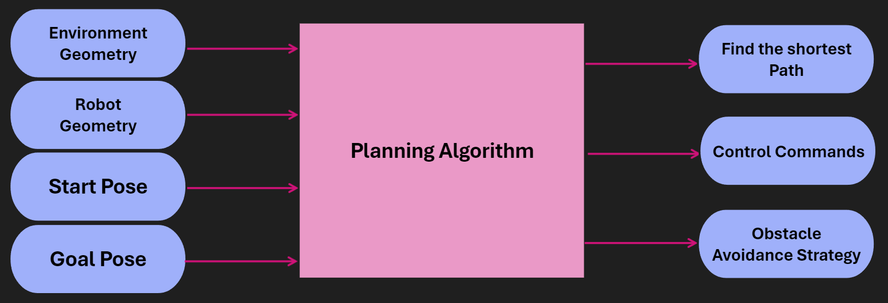
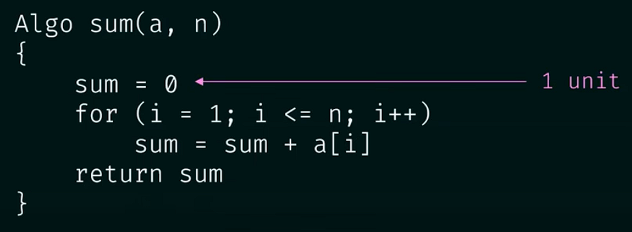
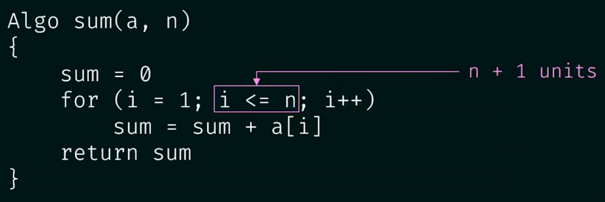

# Motion Planning

Welcome to the motion planning section of the autonomouse systems! In the last few sections we learned about how the autonomous systems work from perception where we learned how the vehicle detects the surrounding environment to SLAM where we learned how how the vehicle determines its location and how it creates a map.

Now we will learn in this section how the vehicle decides on the path it will take from the start position to the goal position and its behaviour during taking that path using different algorithms and this is called Motion Planning.

> **Prior knowledge is required—you must have seen/studied the previous 3 sessions about the introduction to autonomous systems, Perception and SLAM.**

---

## About the instructor

👋 Hi! I'm **Ahmed ElShaboury**

* 🎓 Mechatronics Level 200
* 🧠  Autonomous Member (Motion Planning) 23-now
* 🤖 Embedded Systems Member 23-now

### Session Agenda:

#### * **What is Motion Planning ?**

* **Define a Planning Problem.**
* **Different Planning Approaches.**
* **Discrete Planning Methods.**
* **Continuous Representation.**
* **Discretization & Its Types.**
* **Graph Search Algorithms.**

---

### What is Motion Planning ?

**Motion planning** is a strategic solution to the problem of "How do I get there?", while **obstacle avoidance** is a series of tactical decisions the robot must make as it moves along its path.

Sitting in your home or office, some environment-specific examples come to mind right away - vacuum robots plan their paths around a house to ensure that every square inch of space gets cleaned. Self-driving cars are starting to appear around us. These vehicles can accept a destination as an input from a human and plan an efficient path that avoids collisions and obeys all traffic regulations.

Motion planning is not limited to robotics applications, in fact it is widely used in several other disciplines. Computer graphics and animation use path planning to generate the motion of characters. While computational biology applies path planning to the folding of protein chains.

---

### Define a Planning Problem

The path planning problem involves determining a feasible route for a robot to navigate from its starting position to a goal position. This process takes into account several key factors: the geometry of the environment, the physical characteristics of the robot itself, the robot's initial pose, and its desired final pose. By considering these elements, a path planning algorithm can compute an optimal trajectory that allows the robot to safely and efficiently reach its destination while avoiding obstacles and adhering to its physical constraints.

#### ***Given:***

* Environment Geometry
* Robot Geometry
* Start Pose
* Goal Pose

#### ***Goal:***

* Find the shortest path
* Control Commands
* Obstacle Avoidance Strategy

---

### Simple Bug Algorithm

Here we will get introduced to a simple algorithm called **The Bug Algorithm** which is part of a bigger family called **The Bug Algorithm Family** and the idea behind the algorithm is presented below:

 *- Head directly towards the goal,*

*- If an obstacle is encountered:*

 *Traverse the obstacle clockwise until you can follow the original path towards the goal again,*

*- Repeat until arrived at goal.*

##### Problem:

In the above example, the robot would end up traversing the outer wall of the obstacle endlessly. There exist variants to the bug algorithm that will remedy this error.

##### Terminology:

* **Complete Algorithm:** An algorithm is complete if it is able to find a path between the start and the goal when one exists.
* **Optimal** **Algorithm:** An algorithm is optimal if it is able to find the best solution.

---

### Different Planning Approaches

#### Discrete Planning:

Discrete Planning is a fundamental approach in robotics and artificial intelligence for solving navigation and path-finding problems. This method involves breaking down continuous space into discrete, manageable units, allowing for systematic analysis and decision-making.

**Key Characteristics:**

1. **Discretization of Workspace:**
   * The robot's environment or workspace is divided into a finite set of distinct states or locations.
   * This discretization creates a representation of the space as a connected graph.
   * Each node in the graph represents a specific location or configuration.
   * Edges between nodes represent possible transitions or movements between states.
2. **Graph Representation:**
   * The discretized workspace is effectively transformed into a graph structure.
   * Nodes may represent spatial coordinates, robot joint configurations, or other relevant state variables.
   * Edges often have associated costs, representing factors like distance, time, or energy required for the transition.
3. **Graph Search Algorithms:**
   * Once the workspace is represented as a graph, various graph search algorithms can be applied.
   * Common algorithms include:
     * Dijkstra's algorithm
     * A* (A-star) search
     * Breadth-First Search (BFS)
     * Depth-First Search (DFS)
   * These algorithms systematically explore the graph to find the optimal path based on specified criteria.
4. **Precision:**
   * Discrete planning is known for its high precision in path calculation.
   * The level of precision can be adjusted by changing the granularity of discretization.
   * Finer discretization leads to more precise paths but increases computational complexity.
5. **Completeness:**
   * Given a fine enough discretization, discrete planning methods are often complete.
   * This means they will find a solution if one exists, provided the discretization captures all possible paths.
6. **Computational Considerations:**
   * While highly precise, discrete planning can be computationally expensive.
   * The computational cost increases with:
     * The size of the workspace
     * The fineness of discretization
     * The complexity of the environment (e.g., obstacles, constraints)
   * For large or complex spaces, the memory requirements can also be significant.
7. **Applications:**
   * Robot navigation in structured environments
   * Game AI for character pathfinding
   * Logistics and supply chain route optimization
   * Circuit board design for routing connections
8. **Limitations:**
   * May struggle with high-dimensional spaces (curse of dimensionality)
   * Can be inefficient for dynamic or rapidly changing environments
   * Discrete representation may not always capture the full complexity of continuous spaces
9. **Enhancements and Variations:**
   * Adaptive discretization methods to balance precision and computational cost
   * Hierarchical approaches to handle large-scale problems
   * Integration with sampling-based methods for high-dimensional spaces

Understanding discrete planning is crucial for roboticists and AI developers, as it forms the basis for many advanced planning techniques and provides insights into the fundamental challenges of path planning and decision-making in structured environments.

#### **Sample-Based Planning:**

Sample-Based Planning is an innovative approach to robot motion planning that addresses some of the limitations of discrete planning, especially in high-dimensional configuration spaces or complex environments. This method strategically samples the workspace to build a representative graph, offering a balance between computational efficiency and path quality.

**Key Characteristics:**

1. **Sampling Process:**
   * Instead of exhaustively discretizing the entire workspace, sample-based planners randomly or quasi-randomly select a finite set of points (samples) from the configuration space.
   * These samples serve as nodes in the graph representation of the workspace.
   * Common sampling strategies include:
     * Uniform random sampling
     * Gaussian sampling
     * Bridge sampling (for narrow passages)
     * Adaptive sampling based on workspace features
2. **Incremental Graph Construction:**
   * The planner incrementally builds a graph or roadmap using the sampled points.
   * Connections (edges) between samples are attempted based on proximity and feasibility.
   * The graph grows over time, gradually capturing the structure and connectivity of the free space.
3. **Collision Checking:**
   * A critical component of sample-based planning is efficient collision checking.
   * Only collision-free samples and connections are added to the graph.
   * Various techniques are used to optimize collision checking, such as hierarchical representations or lazy evaluation.
4. **Popular Algorithms:**
   * Probabilistic Roadmap (PRM): Builds a roadmap of the entire space, suitable for multi-query scenarios.
   * Rapidly-exploring Random Tree (RRT): Grows a tree from the start configuration, efficient for single-query problems.
   * RRT*: An asymptotically optimal version of RRT that continually refines the solution.
   * Bidirectional RRT: Grows trees from both start and goal configurations.
5. **Precision and Completeness:**
   * The resulting graph is generally less precise than one created by discrete planning.
   * Sample-based planners are probabilistically complete: as the number of samples approaches infinity, the probability of finding a solution (if one exists) approaches 1.
   * In practice, they often find solutions quickly but may not guarantee optimality.
6. **Computational Efficiency:**
   * Generally much faster to construct than full discrete representations, especially in high-dimensional spaces.
   * The efficiency comes from the relatively small number of samples used.
   * Well-suited for real-time applications or scenarios with time constraints.
7. **Path Quality:**
   * Paths generated may not be optimal but are typically feasible and practical.
   * Post-processing techniques (e.g., smoothing, shortcutting) can improve path quality.
8. **Advantages:**
   * Scales well to high-dimensional configuration spaces.
   * Effective in cluttered or complex environments.
   * Can handle non-holonomic constraints more easily than some discrete methods.
   * Adaptable to different types of robots and planning scenarios.
9. **Limitations:**
   * May struggle with very narrow passages or highly constrained spaces.
   * Solution quality depends on sampling distribution and density.
   * Requires careful tuning of parameters for optimal performance.
10. **Applications:**
    * Motion planning for robotic arms with many degrees of freedom.
    * Path planning for autonomous vehicles in complex environments.
    * Character animation in computer graphics.
    * Protein folding simulations in computational biology.
11. **Recent Developments:**
    * Integration with machine learning for intelligent sampling strategies.
    * Asymptotically optimal variants that improve solution quality over time.
    * Parallel and GPU-accelerated implementations for faster computation.

Sample-Based Planning represents a significant advancement in motion planning, especially for complex, high-dimensional problems. Its ability to quickly generate feasible paths makes it invaluable in many robotics and automation applications where real-time performance is crucial. While the paths may not always be optimal, the trade-off between speed and optimality is often favorable in practical scenarios.

#### **Probabilistic Planning:**

Probabilistic Planning represents a sophisticated approach to robot motion planning that explicitly accounts for uncertainties in robot actions, sensor measurements, and the environment. Unlike discrete or sample-based planning methods that assume perfect execution of planned actions, probabilistic planning acknowledges and incorporates the inherent unpredictability of real-world robotics scenarios.

**Key Characteristics:**

1. **Uncertainty Modeling:**
   * Explicitly represents uncertainties in:
     * Robot motion (e.g., imperfect actuators, wheel slippage)
     * Sensor measurements (e.g., noisy or imprecise readings)
     * Environmental dynamics (e.g., moving obstacles, changing conditions)
   * Uses probability distributions to model these uncertainties
   * Common representations include Gaussian distributions for continuous variables and discrete probability tables for discrete states
2. **State Estimation:**
   * Incorporates techniques like Bayesian filtering to estimate the robot's true state
   * Common methods include:
     * Kalman filters for linear systems with Gaussian noise
     * Particle filters for non-linear, non-Gaussian systems
   * Helps in maintaining a belief state (probability distribution over possible states) rather than a single, deterministic state
3. **Decision-Making Under Uncertainty:**
   * Plans actions based on the current belief state rather than a single assumed state
   * Aims to maximize expected utility or minimize expected cost over possible outcomes
   * Often formulated as a Markov Decision Process (MDP) or Partially Observable Markov Decision Process (POMDP)
4. **Risk Assessment and Management:**
   * Evaluates the risk associated with different action sequences
   * Can incorporate cost functions that penalize proximity to obstacles or sensitive areas
   * Allows for risk-aware planning, crucial in high-stakes environments (e.g., surgical robots, space exploration)
5. **Adaptive and Robust Planning:**
   * Generates plans that are robust to various possible outcomes
   * Can adapt plans on-the-fly based on new information or unexpected events
   * Often involves replanning or plan repair strategies
6. **Applications in Constrained Environments:**
   * Particularly valuable in highly-constrained or high-risk scenarios:
     * Narrow passages where precise motion is critical
     * Environments with sensitive equipment or hazardous materials
     * Human-robot interaction scenarios where safety is paramount
   * Helps in navigating cluttered environments by considering the probability of collision
7. **Integration with Sensing and Control:**
   * Often combined with advanced sensing techniques (e.g., SLAM - Simultaneous Localization and Mapping)
   * Incorporates feedback control strategies to handle deviations from the planned path
8. **Computational Considerations:**
   * Generally more computationally intensive than deterministic planning approaches
   * May require approximation techniques for real-time performance in complex scenarios
   * Recent advancements in algorithms and hardware have made probabilistic planning more feasible for real-time applications
9. **Popular Algorithms and Techniques:**
   * Monte Carlo Tree Search (MCTS) for decision-making in large state spaces
   * Probabilistic Roadmaps (PRM) with uncertainty considerations
   * Rapidly-exploring Random Belief Trees (RRBT) for planning in belief space
   * Policy iteration and value iteration for solving MDPs and POMDPs
10. **Challenges and Ongoing Research:**
    * Scalability to high-dimensional state and action spaces
    * Efficient online replanning in dynamic environments
    * Balancing computational complexity with real-time performance requirements
    * Incorporating learning techniques to improve probabilistic models over time
11. **Benefits in Various Domains:**
    * Robotics: Improved safety and reliability in autonomous navigation and manipulation
    * Healthcare: Enhanced precision in surgical robots and assistive devices
    * Autonomous Vehicles: Better handling of traffic uncertainties and pedestrian behavior
    * Search and Rescue: More effective planning in unpredictable disaster scenarios

Probabilistic Planning represents a significant advancement in motion planning, especially for scenarios where uncertainties play a crucial role. By explicitly modeling and reasoning about uncertainties, it allows robots to make more informed and robust decisions. This approach is particularly valuable in sensitive or high-risk environments where the consequences of errors can be severe. As robotics systems become more advanced and are deployed in increasingly complex and dynamic environments, the importance of probabilistic planning continues to grow.

### Discrete Planning Methods

#### Continuous Representation:

In the field of robotics and motion planning, the concept of Configuration Space (C-space) stands as a fundamental principle that revolutionized how we approach complex planning problems. Introduced by Tomás Lozano-Pérez in the 1980s, C-space provides a powerful framework that continues to be a cornerstone of modern robotics research and development.

At its core, the Configuration Space represents the set of all possible configurations or poses that a robot can assume. Each point within this abstract space corresponds to a unique configuration of the robot. The dimensionality of C-space is directly tied to the robot's degrees of freedom (DOF). For instance, a simple 2D mobile robot would have a 3D C-space (x, y, θ), while a more complex 6-DOF robotic arm would require a 6D C-space to fully represent its possible configurations.

One of the key strengths of C-space lies in its ability to transform the physical workspace into an abstract space where the robot can be represented as a single point. This transformation significantly simplifies the process of collision checking and path planning. In the physical workspace, planning algorithms must constantly consider the robot's geometry and size when checking for collisions with obstacles. However, by inflating obstacles in C-space to account for the robot's dimensions, we can treat the robot as a dimensionless point for planning purposes.

The process of obstacle inflation is crucial in creating this simplified representation. Physical obstacles in the workspace are expanded in C-space based on the robot's geometry and size. The amount of inflation depends on factors such as the robot's dimensions and shape. After this inflation process, the C-space can be neatly decomposed into two subsets: C(Free) and C(Obs). C(Free) represents the set of all collision-free configurations, while C(Obs) encompasses configurations where the robot would collide with obstacles. The relationship between these subsets is straightforward: C(Free) is equal to the entire C-space minus C(Obs).

This representation offers several significant advantages in motion planning. Firstly, it greatly simplifies collision checking, as planners only need to verify if a point lies within C(Free). Additionally, C-space provides a unified representation for different types of robots, allowing for the direct application of various search and planning algorithms. These benefits have made C-space an indispensable tool in applications ranging from path planning for mobile robots and manipulators to collision avoidance in multi-robot systems and analysis of robot workspace and reachability.

##### Minkowski Sum:

The Minkowski sum is a powerful mathematical concept that plays a crucial role in robotics, particularly in the creation of configuration spaces for motion planning. Named after Hermann Minkowski, this operation provides a systematic way to compute the configuration space given the geometries of both the obstacles in the environment and the robot itself. Understanding the Minkowski sum is essential for roboticists and AI developers working on path planning and collision avoidance systems.

At its core, the Minkowski sum of two sets A and B is defined as the set of all points that are the sum of any point in A with any point in B. In the context of robot motion planning, set A typically represents the obstacle geometry, while set B represents the robot geometry, often referred to as the robot's footprint. The resulting Minkowski sum effectively "grows" the obstacles by the shape of the robot, creating the configuration space obstacles.

The process of applying the Minkowski sum to create a configuration space involves performing this operation for every obstacle in the workspace. This systematic approach transforms the physical workspace, where the robot has a specific shape and size, into an abstract configuration space where the robot can be represented as a single point. The beauty of this transformation lies in its ability to simplify collision checking: if the point representing the robot's configuration does not intersect with any of the grown obstacles in the configuration space, it means the actual robot would not collide with any obstacles in the physical workspace.

The impact of robot size on the configuration space is particularly noteworthy. As illustrated in various examples, the size of the robot directly influences the degree of obstacle inflation in the configuration space. For a robot that is essentially a point (or very small compared to the obstacles), the obstacles in the workspace are only slightly enlarged in the resulting configuration space. However, as the size of the robot increases, the obstacles in the configuration space become increasingly inflated. This relationship between robot size and obstacle inflation in the C-space is crucial for understanding how different robots interact with the same environment.

In practice, computing the Minkowski sum can be computationally intensive, especially for complex robot and obstacle geometries in three-dimensional spaces. Various algorithms and approximation techniques have been developed to make this process more efficient. For simple geometries, such as convex polygons, the computation can be relatively straightforward. However, for non-convex shapes or in higher dimensions, more sophisticated algorithms are required.

##### 3D Configuration Space:

In our previous discussions of configuration spaces, we primarily focused on the translational movement of robots in a 2D plane. These 2D configuration spaces elegantly represented the x- and y-translations of a robot, providing a straightforward visualization of the robot's possible positions in relation to obstacles. However, the introduction of rotation as a capability for the robot adds a new layer of complexity to this representation.

Rotation introduces an additional degree of freedom to the robot's movement. While this might seem like a minor addition, it has a profound impact on the configuration space. The configuration space, being a complete representation of all possible states of the robot, must now account for this rotational capability. As a result, we transition from a 2D configuration space to a 3D configuration space.

This 3D configuration space incorporates three dimensions: the x-translation, y-translation, and rotation (often denoted as θ) of the robot. Each point in this 3D space represents a unique configuration of the robot, specifying not just its position but also its orientation. This additional dimension allows for a more comprehensive representation of the robot's state, capturing the full range of possibilities for its placement and orientation in the environment.

Visualizing a 3D configuration space can be more challenging than its 2D counterpart. While 2D spaces can be easily drawn on paper or a computer screen, 3D spaces require more sophisticated visualization techniques. Common approaches include using 3D rendering software, creating slices or cross-sections of the 3D space, or employing color coding to represent the third dimension on a 2D plot.

The implications of this 3D representation are significant for motion planning algorithms. Planners must now navigate a three-dimensional space, considering not just the position of the robot but also its orientation when determining collision-free paths. This increased dimensionality can lead to more complex computational requirements but also allows for more sophisticated and realistic motion planning.

##### Potential Field:

To accomplish its task, the potential field method generates two functions - one that **attracts** the robot to the goal and one that **repels** the robot away from obstacles. The two functions can be **summed** to create a discretized representation. By applying an optimization algorithm such as gradient descent, a robot can move toward the goal configuration while steering around obstacles.

###### Attractive Potential Field:

The attractive potential field is a function with the global minimum at the goal configuration. If a robot is placed at any point and required to follow the direction of steepest descent, it will end up at the goal configuration. This function does not need to be complicated, a simple quadratic function can achieve all of the requirements discussed above.

Where **X** represents the robot's current position, and **X(goal)** the goal position. **ν(att)** is a scaling factor.

###### Repulsive Potential Field:

The repulsive potential field is a function that is equal to zero in free space, and grows to a large value near obstacles. One way to create such a potential field is with the function below.

Where the function **ρ(x)** returns the distance from the robot to its nearest obstacle, **ρ(0)** is a scaling parameter that defines the reach of an obstacle's repulsiveness, and **ν(rep)** is a scaling parameter.

###### Potential Field Sum:

The **attractive** and **repulsive** functions are **summed** to produce the potential field that is used to guide the robot from anywhere in the space to the goal. The image below displays the final function.

Imagine placing a marble onto the surface of the function - from anywhere in the field it will roll in the direction of the goal without colliding with any of the obstacles (as long as **ρ(0)** is set appropriately)

The gradient of the function dictates which direction the robot should move, and the speed can be set to be constant or scaled in relation to the distance between the robot and the goal.

#### Descretization:

It's the process of breaking down a continuous entity (Configuration Space) into Discrete Segments.

##### Roadmap:

The first group of discretization approaches is referred to by the name **Roadmap**. These methods represent the configuration space using a **simple connected graph** - similar to how a city can be represented by a **metro map**.

Roadmap methods are typically implemented in two phases:

* **The construction phase:** builds up a graph from a continuous representation of the space. This phase usually takes a significant amount of time and effort, but the resultant graph can be used for multiple queries with minimal modifications.
* **The query phase:** evaluates the graph to find a path from a start location to a goal location. This is done with the help of a search algorithm.

In this Discretization section, we will only discuss and evaluate **the construction phase** of each Roadmap method. Whereas the query phase will be discussed in more detail in the Graph Search section, following Discretization.

###### Visibility Graph:

The Visibility Graph builds a roadmap by connecting the start node, all of the obstacles' vertices, and goal node to each other - except those that would result in collisions with obstacles. The Visibility Graph has its name for a reason - it connects every node to all other nodes that are "visible" from its location.

> **Nodes:** Start, Goal, and all obstacle vertices.

> **Edges:** An edge between two nodes that does not intersect an obstacle, including obstacle edges.

The motivation for building Visibility Graphs is that the shortest path from the start node to the goal node will be a piecewise linear path that bends only at the obstacles’ vertices. This makes sense intuitively - the path would want to hug the obstacles' corners as tightly as possible, as not to add any additional length.

Once the Visibility Graph is built, a **search algorithm** can be applied to find the shortest path from Start to Goal.

###### Voronoi Diagram:

Another discretization method that generates a roadmap is called **the Voronoi Diagram**. Unlike the visibility graph method which generates the shortest paths, Voronoi Diagrams **maximize clearance between obstacles**.

A Voronoi Diagram is a graph whose edges **bisect the free space** in between obstacles. Every edge lies equidistant from each obstacle around it - with the greatest amount of clearance possible.

Once a Voronoi Diagram is constructed for a workspace, it can be used for multiple queries. Start and goal nodes can be connected into the graph by constructing the paths from the nodes to the edge closest to each of them.

Every edge will either be a **straight line**, if it lies between **the edges of two obstacles**, or it will be a **quadratic**, if it passes by **the vertex of an obstacle**.

##### Cell Decomposition:

Another discretization method that can be used to convert a configuration space into a representation that can easily be explored by a search algorithm is cell decomposition. Cell decomposition divides the space into discrete cells, where each cell is a node and adjacent cells are connected with edges. There are two distinct types of cell decomposition:

* Exact Cell Decomposition
* Approximate Cell Decomposition.

###### Exact Cell Decomposition:

Exact cell decomposition divides the space into **non-overlapping** cells. This is commonly done by breaking up the space into **triangles and trapezoids**, which can be accomplished by adding vertical line segments at every obstacle's vertex.

Once a space has been decomposed, the resultant graph can be used to search for the shortest path from start to goal.

Exact cell decomposition is elegant because of its precision and completeness. Every cell is either **full**, meaning it is **completely occupied by an obstacle**, or it is **empty**, meaning it is **free**. And the union of all cells exactly represents the configuration space. If a path exists from start to goal, the resultant graph will contain it.

To implement exact cell decomposition, the algorithm **must order all obstacle vertices along the x-axis**, and then for **every vertex** determine whether a new cell must be created or whether two cells should be merged together. Such an algorithm is called the **Plane Sweep algorithm**.

Exact cell decomposition results in cells of **awkward shapes**. Collections of uniquely-shaped **trapezoids and triangles** are **more difficult** to work with than a regular **rectangular grid**. This results in an added **computational complexity**, especially for environments with **greater numbers of dimensions**. It is also difficult to compute the decomposition when obstacles are **not polygonal**, but of an **irregular shape**.

For this reason, there is an alternate type of cell decomposition, that is much more practical in its implementation.

###### Approximate Cell Decomposition:

Approximate cell decomposition divides a configuration space into discrete cells of **simple**, **regular shapes** - such as **rectangles and squares** (or their multidimensional equivalents). Aside from **simplifying the computation** of the cells, this method also supports **hierarchical decomposition of space.**

The method **recursively** decomposes a space into **four quadrants**. Each quadrant is marked **full**, **empty**, or **mixed** (used to represent cells that are **somewhat occupied** by an obstacle), but also contain some free space. If a sequence of free cells cannot be found from start to goal, then the mixed cells will be **further decomposed** into another four quadrants. Through this process, more free cells will emerge, eventually revealing a path if one exists.

The 2-dimensional implementation of this method is called **quadtree decomposition**.

The algorithm behind approximate cell decomposition is much simpler than the exact cell decomposition algorithm:

 *-Decompose the configuration space into four cells, label cells free, mixed, or full,*

 *-Search for a sequence of free cells that connect the start node to the goal node,*

 *-If such a sequence exists:*

* Return path.*

 *-Else:*

* Further decompose the mixed cells.*

---

The three dimensional equivalent of quadtrees are octrees, depicted in the image below. The method of discretizing a space with any number of dimensions follows the same procedure as the algorithm described above, but expanded to accommodate the additional dimensions.

---

Although exact cell decomposition is a **more elegant** method, it is much more **computationally expensive** than approximate cell decomposition for **non-trivial** environments. For this reason, approximate cell decomposition is **commonly used in practice**.

With enough computation, approximate cell decomposition **approaches completeness**. However, it is **not optimal** - the resultant path depends on how cells are decomposed. Approximate cell decomposition finds the **obvious solution quickly**. It is possible that the optimal path squeezes through a **minuscule opening** between obstacles, but the resultant path takes a much longer route through wide open spaces - one that the **recursively-decomposing algorithms** would find first.

Approximate cell decomposition is **functional**, but like all discrete path planning methods - it starts to be **computationally intractable** for use with **high-dimensional environments**.

### Graph Search:

It's used to find finite sequence of discrete actions to connect the start state to the goal state, it does so by searching, visiting states sequentially asking every state "Hey! Are you the goal state ?"

#### Uninformed Search vs Informed Search:

Uninformed search algorithms are not provided with any information about the whereabouts of the goal, and thus search blindly. The only difference between different uninformed algorithms is the order in which they expand nodes. Several different types of uninformed algorithms are listed below:

* Breadth-first Search
* Depth-first Search
* Uniform Cost Search

Informed searches, on the other hand, are provided with information pertaining to the location of the goal. As a result, these search algorithms are able to evaluate some nodes to be more promising than others. This makes their search more efficient. The informed algorithm that you will be learning in this lesson is,

* A* Search

##### Time Complexity:

It's an estimation of the total **CPU Computations** required to execute an algorithm.

It assesses how long it takes an algorithm to generate a path, usually with respect to the number of nodes or dimensions present. It can also refer to the trade-off between quality of an algorithm (ex. completeness) vs its computation time.

###### Example:

---

##### Space Complexity:

It's the estimation of the **main memory space** required to execute an algorithm.

It assesses how much memory is required to execute the search. Some algorithms must keep significant amounts of information in memory throughout their run-time, while others can get away with very little.

###### Example:

---

#### Breadth-First Search:

Breadth-First Search (BFS) is a fundamental algorithm in computer science and plays a significant role in robot motion planning. As its name suggests, BFS explores a space broadly before delving deeply into any particular path.

                              

At its core, BFS is classified as an uninformed search algorithm. This classification is significant because it means that BFS operates without any prior knowledge of the space it's exploring or the location of its goal. In essence, it searches blindly, systematically expanding outward from its starting point without any heuristic guidance. This blind search nature is both a strength and a weakness of BFS, influencing its applicability in various robotics scenarios.

The operation of BFS in a robotics context can be visualized as a robot exploring its configuration space layer by layer. Starting from its initial configuration, the robot first examines all immediately adjacent configurations. These might represent small movements in various directions or slight changes in joint angles, depending on the robot's degrees of freedom. Only after exhausting all possibilities at this first "layer" does the algorithm move on to explore configurations that are two steps away from the start, then three steps, and so on.

This methodical, layer-by-layer exploration ensures that BFS always finds the path with the fewest steps between the start and goal configurations, if such a path exists. In robotics, this translates to finding the path that requires the least number of discrete movements or configuration changes. This property can be particularly useful in scenarios where each movement has a significant cost or where the robot's energy conservation is a primary concern.

However, the uninformed nature of BFS comes with notable drawbacks in terms of efficiency. Because it explores all directions equally without any consideration of which might be more promising, BFS can be computationally expensive and time-consuming, especially in large or complex configuration spaces. In practical robotics applications, where the configuration space might be vast (consider a robot arm with many joints, each adding a dimension to the space), BFS can quickly become impractical due to its exhaustive search pattern.

#### Depth-First Search:

Depth-First Search (DFS) is a fundamental algorithm in computer science that finds significant applications in robot motion planning. As its name suggests, DFS explores a space by delving deeply into one path before backtracking and exploring alternatives.

                       

In the context of robot motion planning, DFS can be visualized as a robot determinedly following a single path as far as it can before retracing its steps and trying a different route. Starting from its initial configuration, the robot would explore one possible movement, then from that new configuration explore another single movement, and so on, creating a deep, narrow exploration pattern. Only when it reaches a dead-end or exhausts all possibilities along a path does it backtrack and explore a different branch of possibilities.

Like Breadth-First Search, DFS is classified as an uninformed search algorithm. This means it operates without prior knowledge of the goal's location or the nature of the space it's exploring. However, the way DFS blindly probes the space is fundamentally different from BFS, leading to distinct behaviors and outcomes in motion planning scenarios.

One of the most notable characteristics of DFS in robot motion planning is that its efficiency is highly dependent on the position of the goal relative to the search pattern. If, by chance, the goal configuration happens to lie along or near the initial path the algorithm explores, DFS can find a solution very quickly. In such cases, it might significantly outperform BFS, especially in large configuration spaces where BFS's layer-by-layer approach could be time-consuming.

However, this same characteristic means that DFS is not guaranteed to be efficient. If the goal configuration is in a different "direction" from the initial deep exploration, DFS might spend a considerable amount of time searching unproductive paths before eventually finding the goal. In the worst-case scenario, where the goal is in the last branch to be explored, DFS could end up searching almost the entire space before finding a solution.

Another important aspect of DFS in robotics applications is its memory efficiency. Unlike BFS, which needs to keep track of all nodes at the current "layer" of exploration, DFS only needs to maintain the current path in memory. This can be a significant advantage in robots with limited onboard memory or when dealing with extremely large configuration spaces where storing all explored states is impractical.

However, the paths found by DFS are not guaranteed to be optimal. Because it accepts the first path it finds to the goal, this path might involve many more steps or a much longer distance than the optimal route. In robotics, this could translate to inefficient movements, higher energy consumption, or longer execution times for the robot's task.

#### Uniform Cost Search:

Uniform Cost Search (UCS) represents a significant advancement in search algorithms, particularly in the context of robot motion planning. Building upon the principles of Breadth-First Search (BFS), UCS introduces a crucial capability: the ability to handle graphs with varying edge costs. This enhancement makes UCS particularly valuable in robotics, where different movements or actions often have distinct associated costs.

At its core, UCS operates on a simple yet powerful principle: it expands nodes in order of increasing path cost. This approach ensures that the algorithm always explores the least costly path first, regardless of the number of steps involved. In robotics applications, this characteristic allows for more nuanced and realistic path planning, as it can account for various factors that influence the "cost" of a robot's movements.

The concept of "cost" in UCS is flexible and can represent a wide range of factors relevant to robot motion. Most commonly, it might represent the time it takes for a robot to move from one configuration to another. However, depending on the specific application and priorities, the cost could also represent energy consumption, wear and tear on the robot's components, risk of collision, or even more complex composite metrics that combine multiple factors.

This flexibility in defining cost makes UCS extremely versatile in robotics. For instance, in a warehouse automation scenario, the cost might primarily represent time, as efficiency is key. In contrast, for a delicate assembly task, the cost might heavily weight precision and smoothness of movement. In a search and rescue robot, the cost might incorporate factors like terrain difficulty and battery life.

The optimality of UCS is one of its most significant advantages in robot motion planning. By always expanding the node with the lowest cumulative path cost, UCS guarantees that the first path found to the goal will be the optimal path according to the defined cost metric. This property is crucial in robotics, where finding not just any path, but the best path according to specific criteria, can be essential for efficiency, safety, or task success.

Implementing UCS in robot motion planning typically involves representing the robot's configuration space as a graph or a discretized grid. Each node in this graph represents a specific configuration of the robot, while edges represent possible movements between configurations. The algorithm maintains a priority queue of nodes to be explored, always selecting the node with the lowest cumulative path cost for expansion.

One of the key differences between UCS and BFS becomes apparent in how they handle path length. While BFS finds the path with the fewest steps, UCS finds the path with the lowest total cost, which may involve more individual steps. This distinction is crucial in robotics, where a longer path might sometimes be preferable if it's smoother, safer, or more energy-efficient.

However, the benefits of UCS come with increased computational requirements compared to simpler algorithms like BFS or Depth-First Search. The need to maintain a sorted priority queue and potentially revisit nodes if a cheaper path is found can make UCS more computationally intensive, especially in large or complex configuration spaces.

In practice, roboticists often enhance UCS with heuristics to improve its efficiency in large search spaces, leading to algorithms like A* search. These enhancements maintain the optimality guarantee of UCS while potentially reducing the number of nodes that need to be explored.

#### A* Search:

A* (pronounced "A-star") Search stands as one of the most powerful and widely used algorithms in the field of robot motion planning. Unlike its predecessors such as Breadth-First Search or Uniform Cost Search, A* is classified as an informed search algorithm. This classification is crucial as it signifies A*'s ability to leverage information about the goal's location during its search process, leading to more efficient and intelligent path finding.

The key to A*'s informed nature lies in its use of a heuristic function, typically denoted as h(n). In the context of robot motion planning, this heuristic function estimates the distance from any given node n to the goal. The choice of heuristic can significantly impact the algorithm's performance and is often tailored to the specific problem at hand. For instance, in a 2D grid-based environment, the Manhattan distance or Euclidean distance to the goal might serve as effective heuristics.

However, A* doesn't solely rely on the heuristic. It also considers the path cost, represented as g(n), which is the actual cost of the path from the start node to the current node n. This dual consideration is what sets A* apart and makes it particularly effective for robot motion planning.

The core principle of A* is to choose the path that minimizes the sum of the path cost and the heuristic function, represented as f(n) = g(n) + h(n). This formula encapsulates the algorithm's strategy: it seeks to balance the known cost of reaching a node with the estimated cost of getting from that node to the goal.

By minimizing g(n), A* favors shorter paths, ensuring that it doesn't unnecessarily wander through the configuration space. This is crucial in robotics, where efficient movements are often desirable to conserve energy, reduce wear on components, or complete tasks quickly.

Simultaneously, by minimizing h(n), A* favors paths that move in the direction of the goal. This directionality is what gives A* its informed characteristic, allowing it to focus its search towards promising areas of the configuration space rather than exploring in all directions equally.

The combination of these two factors – minimizing actual path cost and estimated remaining cost – allows A* to make intelligent decisions about which nodes to explore next. In practice, this often results in A* exploring far fewer nodes than uninformed search algorithms, leading to faster planning times and more efficient use of computational resources.

**h(n) = distance to goal**

,it also takes into account the "**Path Cost**"

**g(n) = path cost**

, A* chooses the path that **minimizes** **the sum of the path cost & the heuristic function**

**f(n) = g(n) + h(n)**

,So it does 2 things:

1. Minimizes **g(n)** ------> **Favours Shorter Path**
2. Minimizes **h(n)** ------> **Favours Paths In The Direction Of The Goal**

One of A*'s most valuable properties in robotics is its optimality guarantee, provided that the heuristic function is admissible (never overestimates the cost to the goal) and consistent (satisfies the triangle inequality). This means that if a path exists, A* will find the optimal path according to the defined cost function.

However, the performance of A* heavily depends on the quality of the heuristic function. A poor heuristic might lead to exploration patterns similar to less informed algorithms, while a well-designed heuristic can dramatically reduce the search space and computation time.

In practical robotics applications, A* often serves as a foundation for more specialized algorithms. For instance, Anytime A* variants provide the ability to find initial solutions quickly and then refine them given more computation time, which is valuable in time-critical scenarios. Other variants like D* (Dynamic A*) adapt the algorithm for replanning in dynamic environments, crucial for robots operating in changing or uncertain conditions.

Implementing A* in robot motion planning systems requires careful consideration of the configuration space representation, cost function design, and heuristic selection. Roboticists must balance the algorithm's thoroughness with computational efficiency, often leading to domain-specific optimizations.

---

### Wrap Up:

In this session, we covered the fundamental concepts of  **motion planning** , starting with a clear definition and breakdown of what constitutes a planning problem—specifically, the given conditions and the goal to achieve. We explored the  **Simple Bug Algorithm** , a foundational example, and introduced key terminology to help frame the discussion.

We then delved into various  **planning approaches** , distinguishing between  **discrete** ,  **sample-based** , and **probabilistic** methods. Discrete planning methods were explained in detail, alongside representations like the **Minkowski Sum** and the  **3D Configuration Space** , which helped us understand the continuous aspect of motion planning.

The session also focused on  **potential fields** , discussing how both attractive and repulsive forces influence an object’s movement through space. We explored how these fields are combined into a single potential field and how they guide pathfinding.

In terms of **descretization** techniques, we reviewed  **roadmaps** ,  **visibility graphs** ,  **Voronoi diagrams** , and  **cell decomposition** , including both exact and approximate methods, which help in representing environments and guiding the planning process.

We moved on to  **graph search techniques** , comparing **uninformed** and **informed** search strategies, analyzing their strengths and weaknesses in terms of  **time complexity** ,  **space complexity** , and  **generality** . Classic search algorithms like  **Breadth-First Search** ,  **Depth-First Search** ,  **Uniform Cost Search** , and **A* Search** were discussed, with an emphasis on their applicability to different types of motion planning problems.

In summary, this session provided a well-rounded understanding of motion planning, combining theoretical knowledge with practical algorithmic approaches, and highlighted the importance of selecting the right methods for specific planning challenges.

### Resources

https://www.udacity.com/course/robotics-software-engineer--nd209

https://www.udacity.com/course/self-driving-car-engineer-nanodegree--nd0013

https://www.mygreatlearning.com/blog/why-is-time-complexity-essential/

https://medium.com/@junbs95/gentle-introduction-to-hybrid-a-star-9ce93c0d7869

https://lavalle.pl/planning/

https://www.youtube.com/playlist?list=PLggLP4f-rq01Q3clJrnWFPRtpUwSlr4mG

---

### **Have Questions? Reach Out!** ✉️

If you have any questions or need further clarification about anything in this documentation, feel free to get in touch. We're here to help you on your journey into the world of autonomous systems!

You can contact us at:

📧  **Email** : mmsautonomousteam@gmail.com

🌐  **GitHub Discussions** : [github](https://github.com/MMSAutonomousTeam/Autonomous-Sessions/discussions)

We're excited to support you and look forward to your questions! 😊
