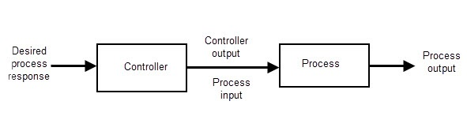
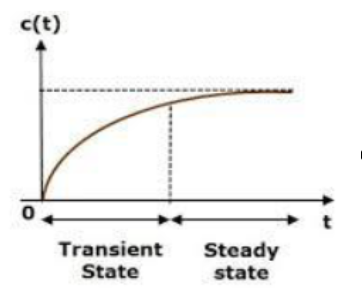
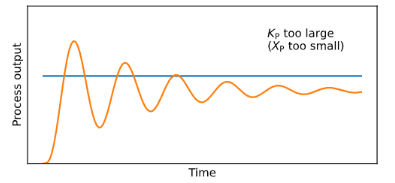
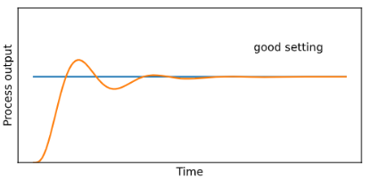
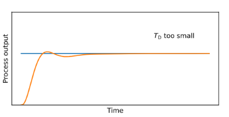
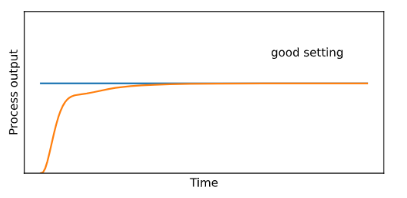
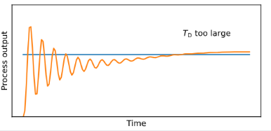
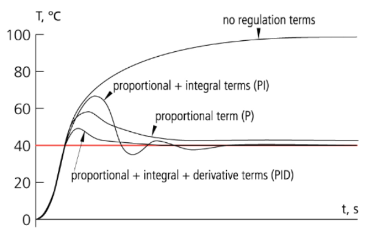

# Control Theory Session

### About the instructor

👋 Hi! I'm Abdallah Nabil

* 🎓 Computer and Control system Level 300
* 🧠  autonomous member (Control) 23-24
* 🤖 contact me: [LinkedIn](https://www.linkedin.com/in/0xabdallah-nabil/)

## Our Outlines:

* Introduction
* PID controller
* Mathematical Modelling
* Pure Pursuit controller
* Stanley controller

## 1.Introduction

First of all we know in the last sessions the process of building an autonomous vehicle consist of  four main stages starting with perception then SLAM after that Path Planning ending with control, and we had known what is the job of each stage its chalanges ,tools, etc. Now its control stage turn

    

Before we start going ahead in our session we should take an over view about control in general, learn and recap about imporant topics starting with :

 1.**What is Control Theory?**

* Control theory is a branch of engineering and mathematics that deals with the behavior of dynamic systems and how to influence that behavior to achieve desired outcomes. and that     lead us to another question:

 2.**What is the useful of the Control?**

* if we want to change the state of the system from unstable to stable behavior or if we want to enhancing and increasing the accuracy of our system to achieve desired outcomes.

 3.**What is the deffrerence between the open & closed loop systems?**

    3.1*open loop system*: The control action is pre-determined based on the input command only and has no feed back.

* example: Automatic Washing Machine
* explanation:In an automatic washing machine, once the user selects a wash cycle (input), the machine will perform the process (output) according to the 			   pre-set instructions. It does not measure whether the clothes are clean or adjust based on any feedback.
* Steps:

  1. **Input:** The user sets the washing cycle (e.g., 30 minutes) and presses start.
  2. **Controller:** The machine begins the cycle and follows the pre-set instructions (washing, rinsing, spinning) without receiving feedback.
  3. **Output:** The washing process completes after the set time.

  

  3.2 closed loop system: The output of the system is continuously monitored and compared to the desired output. Feedback is used to make adjustments to the input in real-time.
* example:Thermostat-Controlled Heating System
* explanation:In a thermostat-controlled heating system, the system measures the current temperature (output) and compares it with the desired set temperature (input). Based on the difference, the system adjusts the heater’s operation to maintain the set temperature.
* Steps:

  1. **Input:** The user sets the desired room temperature (e.g., 22°C).
  2. **Controller:** The thermostat measures the current room temperature using a temperature sensor.
  3. **Feedback:** The system continuously monitors the room temperature and compares it to the set value.
  4. **Action:** If the room temperature is lower than 22°C, the heating system turns on. If it exceeds 22°C, the heating system turns off.
  5. **Output:** The room temperature reaches and maintains the set value of 22°C.

  

**4.What is the Response Time Analysis?**

* **Response time analysis is a process used to assess and evaluate the time it takes for a system or component to respond to a stimulus or input ( *transiant state* )and reach a stable or desired state (*steady state* ).**

  

**5.What is the** **Methods of Stability Analysis?**

* Routh-Hurwitz Criterion
* Nyquist Stability Criterion
* Bode Plot Analysis
* Root Locus Method
* State-Space Analysis

**6.Why we use Stability Analysis?**

1. **Prevent Uncontrolled Behavior** :If a system is unstable, its output can grow uncontrollably, potentially leading to system damage or failure. Stability analysis helps identify whether a system will remain within safe operating limits or if it will diverge due to disturbances or system changes.
2. Predictable Performance : A stable system returns to equilibrium after disturbances. Without stability, the system may behave erratically, making it impossible to guarantee consistent or predictable performance which is critical for control systems in aviation, automotive, and industrial automation.
3. Reduce Overshoot and Oscillations : An unstable system may experience excessive oscillations or overshooting the desired target value. Stability analysis ensures that such oscillations are minimized or eliminated
4. Safety : Many control systems operate in critical environments like nuclear plants, aircraft, and medical devices, where instability could lead to catastrophic failures or even endanger lives.
5. Optimize System Performance : A system can be stable but still exhibit poor performance (e.g., slow response, excessive overshoot, or long settling time). Stability analysis allows designers to fine-tune system performance, ensuring that it is both stable and operates efficiently under different conditions.

---

## 2.PID Controller

**PID controller** (Proportional-Integral-Derivative controller) is a closed loop controller work with feedback mechanism widely used in industrial to maintain a desired setpoint by automatically adjusting the control inputs,its easy to implement and suitable for almost all linear systems electrical and mechanical.

PID controllers are used in industrial applications where precise control is necessary, including:

* **Temperature control** (e.g., furnaces, ovens, HVAC systems).
* **Flow control** (e.g., chemical processes, water treatment plants).
* **Pressure control** (e.g., boilers, gas systems).
* **Robotics** (e.g., positioning systems, arm control).
* **Autonomous vehicles** (e.g., steering, throttle control).

PID controllers has three different components :

1. Proportional Component: This term produces an output value that is proportional to the current error,this term act as {***proportional kick***}.
2. Integral Components: The integral term accounts for the accumulation of past errors over time act as {***automatic offset-error remover}***.
3. Differential Components:This term predicts future errors by calculating the ***rate of change*** of the error.

---

* firstly we should know the equations of the PID controller :

**1-The basic equation form:**

* to easily adjust the controller components we use three gain parameters ( Kp, Ki, Kd),increasing or decrease this param to reach your desired performance and output.

**2-The common alternative form:**

* **Ti (Integral Time Constant)** :It represents the time over which the integral action accumulates the error to have a significant effect on the output.
* **T**d **(Derivative Time Constant)** :It defines how much the derivative action responds to the rate of change of the error.

**3-The standard equation in discrete form:**

* this form used in the discrete reading situation, it's suitable and simple equation to code it.
  * note: Integral term must be multiplied by detla T .

---

### 1.Proportional Component:

* This term produces an output proportional to the current error. If the error is large, the control response will also be large.

  1. Large Kp makes the system overshoting,haveing oscillations.

     
  2. suitable Kp fasting the system response with offset.

     
  3. small Kp act as u don't have proportional term at all.

     

### 2.Integral Components:

* helping eliminate any steady-state error that remains after the proportional action.

  1. large Ki makes the system overshooting too hard.

     
  2. suitable Ki remove the offset and if there is any disturbance occurred, integral term remove it automatically and fasting the arriving to steady state.

     
  3. small Ki slowing arriving to steady state ,system may doesn't have any oscillations.

     

### 3.Differential Components:

* It helps to dampen the system, reducing oscillations, providing smoother control and preventing overshooting.
  1. large Kd makes the system overdamed makes the system response very slow.

     
  2. suitable Kd removes any overshooting also removing the oscillations.

     
  3. small Kd makes system suffering from oscillations and overshoting

     

### 4.Changes in the curve after adding each term one by one

---

### **PID Tuning Methods:**

* **Trial & error :** It’s the simplest as you keep changing Kp,Ki,Kd till you get the desired response.
* **Frequency Response Analysis Method:** You analyze the frequency response of the system by transforming to Laplace domain, drawing S-plane plot, bode Plot, Nyquist Plot, etc, and determining the stable gain range
* **Ziegler Nichols.**
* **Cohen-Coon Method.**
* **Optimization Algorithms.**
* **Tyreus-Luyben Method.**

---

## 3.**MATHEMATICAL MODELING**

Mathematical modeling of a system refers to the notion of describing the response of a system to the control inputs while accounting the state of the system using mathematical equations. The following analogy of an autonomous vehicle better explains this notion. When control inputs are applied to an autonomous vehicle, it moves in a very specific way depending upon the control inputs. For example, throttle increases the acceleration, brake reduces it, while steering alters the heading of the vehicle by certain amount. A mathematical model of such an autonomous vehicle will represent the exact amount of linear and/or angular displacement, velocity, acceleration, etc. of the vehicle depending upon the amount of applied throttle, brake and/or steering input.

In order to actually develop a mathematical model of autonomous vehicle (or any system for that matter), ***there are two methods widely used in industry and academia***.

#### 1. First Principles Modeling

This approach is concerned with applying the fundamental principles and constituent laws to derive the system models. It is a theoretical way of dealing with mathematical modeling, which does not necessarily require access to the actual system and is mostly adopted for deducing generalized mathematical models of the concerned system. We will be using this approach in the upcoming section to formulate the kinematic and dynamic models

#### 2. Modeling by System Identification

This approach is concerned with applying known inputs to the system, recording it’s responses to those inputs and statistically analyzing the input-output relations to deduce the system models. This approach is a practical way of dealing with mathematical modeling, which requires access to the actual system and is mostly adopted for modeling complex systems, especially where realistic system parameters are to be captured. It is to be noted that this approach is often helpful to estimate system parameters even though the models are derived using first principles approach.

We make the following assumptions and consider the following motion constraints for modeling the vehicle.

### Assumptions:

1. The road surface is perfectly planar, any elevations or depressions are disregarded. This is known as the planar assumption.
2. Front and rear wheels are connected by a rigid link of fixed length.
3. Front wheels are steerable and act together, and can be effectively represented as a single wheel.
4. Rear wheels act together and can be effectively represented as a single wheel.
5. The vehicle is actually controllable like a bicycle.

### Motion Constraints:

1. Pure Rolling Constraint: This constraint implies the fact that each wheel follows a pure rolling motion w.r.t. ground; there is no slipping or skidding of the wheels.
2. Non-Holonomic Constraint: This constraint implies that the vehicle can move only along the direction of heading and cannot arbitrarily slide along the lateral direction.

*note: We will be using First Principles Modeling approach in the upcoming section to formulate the kinematic and dynamic models of a front wheel steered non-holonomic vehicle.*

### 1.Kinematic Modelling

It is simple mathematical representation of the car model that doesn’t take all the forces and moments acting on the car into account but simplify the car model equations,In this section, we present two of the most widely used kinematic model for autonomous vehicles.

#### 1.1 Differential Kinematic Model

We represent the car as a simple nonholonomic body with two wheels at the sides.The motion of the car is governed by the following equations.If the two wheels are rotating at the same speed, the car will move in a straight line, but if one of the wheels is rotatingwith a speed higher than the other, the car will rotate aroundthe slower wheel with a speed of `X’` and `Y’`, the car will alsorotate with an angle `𝜃` and with a rotating speed `𝜃′`.

#### 1.2  Kinematic Bicycle Mode

Modelwe represent the car as a bicycle where the front wheels and rear wheels are merged into a single wheel. This model is more accurate than the differential model and widely used.There are three ways of deriving the mathematical model where we choose different reference point for the car calculations:

### **2.Dynamic Modelling**

**A **more complex** and accurate representation of the car model where we take all the **acting forces** and **moments** into account. In this section, we present two of the most widely used Dynamic model for autonomous vehicles.**

#### 2.1 Longitudinal Model

The free-body diagram of an autonomous vehicle along the longitudinal direction (denoted as x) is depicted in figure 1.3. The longitudinal forces considered include
vehicle inertial term `m` * `x''`, front and rear tire forces ` Fxf` and `Fxr`, aerodynamic resistance `Faero`, front and rear rolling resistance `Rxf` and `Rxr`, and x component of
the gravitational force `m` * `g` * `sin (alpha)` (since y component of the gravitational force `m` * `g` * `cos (alpha)` and normal force `FN` cancel each other). **Note that the tire forces
assist the vehicle to move forward whereas all other forces resist the forward vehicle motion.**

#### 2.2 **Lateral Model**

The free-body diagram of an autonomous vehicle along the lateral direction (denoted as y) is depicted in the figure. The lateral forces considered include the inertial term
`m` * `ay` and the front and rear tire forces Fyf and Fyr, respectively. The torques considered include vehicle torque about instantaneous center of rotation `Iz` * `theta''`, and
moments of front and rear tire forces `lf` * `Fyf` and `lr` * `Fyr`, respectively (acting in opposite direction). Thus, applying Newton’s second law of motion to the free-body
diagram we get.

* for more details of the four methods and its mathmatical equation representaion you can find it in **[CONTROL STRATEGIES FOR AUTONOMOUS VEHICLES](https://arxiv.org/pdf/2011.08729)** book in the sources section.

## 4.Pure pursuit

The pure pursuit method consists of geometric path tracking controller, calculating the curvature of a circular arc that connects the rear axle location to a goal point on the path ahead of the vehicle, Depend on eliminating ***cross track*** error only .

If we consider the center of the rear axle of the ego vehicle as the frame of reference,we have the geometric relations as shown in the figure Here, the ego vehicle wheelbase
is `L`, forward velocity of the ego vehicle is ` vf` , steering angle of the ego vehicle is `gamma`, distance between lookahead point on reference trajectory and the center of the
rear axle of the ego vehicle is the lookahead distance `dl`, the angle between vehicle heading and the lookahead line is `alpha`. Since the vehicle is a rigid body with forward
steerable wheels, for non-zero `vf `and `delta`, the vehicle follows a circular path of radius `R` (corresponding to curvature `k`) about the instantaneous center of rotation (`ICR`).

mathmatical equation representaion of pure pursuit controller:

reference to up figure & from the law of sines,

* `k`  called curve curvature its like a parameters we use in our equations.
* `e delta` is the cross track error.

With reference to up figure the steering angle command `delta` can be computed using the following relation,

Substituting the value of `k` from curve curvature equation in steering angle equation and solving for `delta`we get,

one of the most important parameter that affect on the behavior of the controller is look ahead distance param `ld` or `dl` (both the same) ,how?

1. samll look ahead
   1. oscillatory path
   2. accurate tracking
      
2. large lookahead distance
   1. less oscilatory path
   2. poor tracking

      

to fix this we need to make it adaptive,how?

the steering law is independent of vehicle velocity ,As a result, if the controller is tuned for low speed, it will be dangerously aggressive at higher speeds while if tuned for
high speed, the controller will be too sluggish at lower speeds. One potentially simple improvement would be to vary the lookahead distance `dl` proportional to the vehicle
velocity `vf` using `kv` as the ***proportionality constant*** (this constant/gain will act as the ***tuning parameter*** for Pure Pursuit controller).

Substituting the value of dl from steering angle equation in up equation we get the completecoupled Pure Pursuit control law formulation as follows.

## 5.Stanley

The Stanley method is a path tracking approach used by Stanford University’s autonomous vehicle entry in the DARPA Grand Challenge Team,uses the center of the front axes as a reference point,Depend on eliminating both,*cross track* *error* and*heading error.*

If we consider the center of the ***front axle*** of the ego vehicle as the frame of reference, we have the geometric relations as shown in up figure. Here, the ego vehicle
wheelbase is `L`, forward velocity of the ego vehicle is `vf` , and steering angle of the ego vehicle is `delta`.

Stanley control law, therefore, is essentially defined to meet the following ***three requirements***.

1. Heading Error Correction: To correct the heading error `e psi` by producing asteering control action `delta` proportional (or equal) to it, such that vehicle heading aligns with the desired heading.

   
2. Cross-Track Error Correction: To correct the cross-track error `e delta` by producing a steering control action `delta` directly proportional to it and inversely proportional
   to the vehicle velocity `vf` in order to achieve coupled-control. Moreover, the effect for large cross-track errors can be limited by using an inverse tangent function.

   

   we might have 2 problem here:

   1. At lower speeds, the denominator becomes small, thus causing the steering command to shoot to higher values, which is undesirable considering human
      comfort. Hence, an extra softening coefficient `ks` may be used in the denominator as an additive term in order to keep the steering commands smaller for
      smoother steering actions.
   2. On the contrary, at higher velocities, the denominator becomes large making the steering commands small in order to avoid large lateral accelerations. However,
      even these small steering actions might be high in some cases, causing high lateral accelerations. Hence, an extra damping coefficient `kd` may be used in
      order to dampen the steering action proportional to vehicle velocity.

   so the result equation is,

   
3. Clipping Control Action: To continuously observe the steering actuation limits [−`delta` max, `delta` max] and clip the steering command within these bounds.

   the final stanley controller form:

## 6.sources

[Self-Driving Cars | Coursera](https://www.coursera.org/specializations/self-driving-cars)

[Three Methods of Vehicle Lateral Control: Pure Pursuit, Stanley and MPC | by Yan Ding | Medium](https://dingyan89.medium.com/three-methods-of-vehicle-lateral-control-pure-pursuit-stanley-and-mpc-db8cc1d32081)

[PID Tuning Guide ](https://tlk-energy.de/blog-en/practical-pid-tuning-guide)

[CONTROL STRATEGIES FOR AUTONOMOUS VEHICLES](https://arxiv.org/pdf/2011.08729 "1")

[Introduction to Control EE313 - YouTube](https://www.youtube.com/playlist?list=PLmK1EnKxphikZ4mmCz2NccSnHZb7v1wV-)

[Classical Control Theory - YouTube](https://www.youtube.com/playlist?list=PLUMWjy5jgHK1NC52DXXrriwihVrYZKqjk)

[Transfer Functions: Introduction and Implementation -YouTube](https://www.youtube.com/playlist?list=PLxdnSsBqCrrF9KOQRB9ByfB0EUMwnLO9o)

[Understanding PID Control - YouTube](https://www.youtube.com/playlist?list=PLn8PRpmsu08pQBgjxYFXSsODEF3Jqmm-y)

---

### **Have Questions? Reach Out!** ✉️

If you have any questions or need further clarification about anything in this documentation, feel free to get in touch. We're here to help you on your journey into the world of autonomous systems!

You can contact us at:

📧  **Email** : mmsautonomousteam@gmail.com

🌐  **GitHub Discussions** : [github](https://github.com/MMSAutonomousTeam/Autonomous-Sessions/discussions)

We're excited to support you and look forward to your questions! 😊
