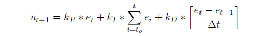

# Control Theory Session

### About the instructor

👋 Hi! I'm Abdallah Nabil

* 🎓 Computer and Control system Level 300
* 🧠  autonomous member (Control) 23-24
* 🤖 contact me: [LinkedIn](https://www.linkedin.com/in/0xabdallah-nabil/)

## Our Outlines:

* Introduction
* PID controller
* Mathematical Modelling
* Pure Pursuit controller
* Stanley controller

## 1.Introduction

First of all we know in the last sessions the process of building an autonomous vehicle consist of  four main stages starting with perception then SLAM after that Path Planning ending with control, and we had known what is the job of each stage its chalanges ,tools, etc. Now its control stage turn

    

Before we start going ahead in our session we should take an over view about control in general, learn and recap about imporant topics starting with :

 1.**What is Control Theory?**

* Control theory is a branch of engineering and mathematics that deals with the behavior of dynamic systems and how to influence that behavior to achieve desired outcomes. and that     lead us to another question:

 2.**What is the useful of the Control?**

* if we want to change the state of the system from unstable to stable behavior or if we want to enhancing and increasing the accuracy of our system to achieve desired outcomes.

 3.**What is the deffrerence between the open & closed loop systems?**

    3.1*open loop system*: The control action is pre-determined based on the input command only and has no feed back.

* example: Automatic Washing Machine
* explanation:In an automatic washing machine, once the user selects a wash cycle (input), the machine will perform the process (output) according to the 			   pre-set instructions. It does not measure whether the clothes are clean or adjust based on any feedback.
* Steps:

  1. **Input:** The user sets the washing cycle (e.g., 30 minutes) and presses start.
  2. **Controller:** The machine begins the cycle and follows the pre-set instructions (washing, rinsing, spinning) without receiving feedback.
  3. **Output:** The washing process completes after the set time.

  

  3.2 closed loop system: The output of the system is continuously monitored and compared to the desired output. Feedback is used to make adjustments to the input in real-time.
* example:Thermostat-Controlled Heating System
* explanation:In a thermostat-controlled heating system, the system measures the current temperature (output) and compares it with the desired set temperature (input). Based on the difference, the system adjusts the heater’s operation to maintain the set temperature.
* Steps:

  1. **Input:** The user sets the desired room temperature (e.g., 22°C).
  2. **Controller:** The thermostat measures the current room temperature using a temperature sensor.
  3. **Feedback:** The system continuously monitors the room temperature and compares it to the set value.
  4. **Action:** If the room temperature is lower than 22°C, the heating system turns on. If it exceeds 22°C, the heating system turns off.
  5. **Output:** The room temperature reaches and maintains the set value of 22°C.

  

**4.What is the Response Time Analysis?**

* **Response time analysis is a process used to assess and evaluate the time it takes for a system or component to respond to a stimulus or input ( *transiant state* )and reach a stable or desired state (*steady state* ).**

  

**5.What is the** **Methods of Stability Analysis?**

* Routh-Hurwitz Criterion
* Nyquist Stability Criterion
* Bode Plot Analysis
* Root Locus Method
* State-Space Analysis

**6.Why we use Stability Analysis?**

1. **Prevent Uncontrolled Behavior** :If a system is unstable, its output can grow uncontrollably, potentially leading to system damage or failure. Stability analysis helps identify whether a system will remain within safe operating limits or if it will diverge due to disturbances or system changes.
2. Predictable Performance : A stable system returns to equilibrium after disturbances. Without stability, the system may behave erratically, making it impossible to guarantee consistent or predictable performance which is critical for control systems in aviation, automotive, and industrial automation.
3. Reduce Overshoot and Oscillations : An unstable system may experience excessive oscillations or overshooting the desired target value. Stability analysis ensures that such oscillations are minimized or eliminated
4. Safety : Many control systems operate in critical environments like nuclear plants, aircraft, and medical devices, where instability could lead to catastrophic failures or even endanger lives.
5. Optimize System Performance : A system can be stable but still exhibit poor performance (e.g., slow response, excessive overshoot, or long settling time). Stability analysis allows designers to fine-tune system performance, ensuring that it is both stable and operates efficiently under different conditions.

---

## 2.PID Controller

**PID controller** (Proportional-Integral-Derivative controller) is a closed loop controller work with feedback mechanism widely used in industrial to maintain a desired setpoint by automatically adjusting the control inputs,its easy to implement and suitable for almost all linear systems electrical and mechanical.

PID controllers are used in industrial applications where precise control is necessary, including:

* **Temperature control** (e.g., furnaces, ovens, HVAC systems).
* **Flow control** (e.g., chemical processes, water treatment plants).
* **Pressure control** (e.g., boilers, gas systems).
* **Robotics** (e.g., positioning systems, arm control).
* **Autonomous vehicles** (e.g., steering, throttle control).

PID controllers has three different components :

1. Proportional Component: This term produces an output value that is proportional to the current error,this term act as {***proportional kick***}.
2. Integral Components: The integral term accounts for the accumulation of past errors over time act as {***automatic offset-error remover}***.
3. Differential Components:This term predicts future errors by calculating the ***rate of change*** of the error.

---

* firstly we should know the equations of the PID controller :

**1-The basic equation form:**

* to easily adjust the controller components we use three gain parameters ( Kp, Ki, Kd),increasing or decrease this param to reach your desired performance and output.

**2-The common alternative form:**

* **Ti (Integral Time Constant)** :It represents the time over which the integral action accumulates the error to have a significant effect on the output.
* **T**d **(Derivative Time Constant)** :It defines how much the derivative action responds to the rate of change of the error.

**3-The standard equation in discrete form:**

* this form used in the discrete reading situation, it's suitable and simple equation to code it.
  * note: Integral term must be multiplied by detla T .

---

### 1.Proportional Component:

* This term produces an output proportional to the current error. If the error is large, the control response will also be large.

  1. Large Kp makes the system overshoting,haveing oscillations.

     
  2. suitable Kp fasting the system response with offset.

     
  3. small Kp act as u don't have proportional term at all.

     

### 2.Integral Components:

* helping eliminate any steady-state error that remains after the proportional action.

  1. large Ki makes the system overshooting too hard.

     
  2. suitable Ki remove the offset and if there is any disturbance occurred, integral term remove it automatically and fasting the arriving to steady state.

     
  3. small Ki slowing arriving to steady state ,system may doesn't have any oscillations.

     

### 3.Differential Components:

* It helps to dampen the system, reducing oscillations, providing smoother control and preventing overshooting.
  1. large Kd makes the system overdamed makes the system response very slow.

     
  2. suitable Kd removes any overshooting also removing the oscillations.

     
  3. small Kd makes system suffering from oscillations and overshoting

     

### 4.Changes in the curve after adding each term one by one

---

### **PID Tuning Methods:**

* **Trial & error :** It’s the simplest as you keep changing Kp,Ki,Kd till you get the desired response.
* **Frequency Response Analysis Method:** You analyze the frequency response of the system by transforming to Laplace domain, drawing S-plane plot, bode Plot, Nyquist Plot, etc, and determining the stable gain range
* **Ziegler Nichols.**
* **Cohen-Coon Method.**
* **Optimization Algorithms.**
* **Tyreus-Luyben Method.**

---

## 3.**MATHEMATICAL MODELING**

## 4.Pure pursuit

## 5.Stanley

## 6.sources

[Self-Driving Cars | Coursera](https://www.coursera.org/specializations/self-driving-cars)

[Three Methods of Vehicle Lateral Control: Pure Pursuit, Stanley and MPC | by Yan Ding | Medium](https://dingyan89.medium.com/three-methods-of-vehicle-lateral-control-pure-pursuit-stanley-and-mpc-db8cc1d32081)

[PID Tuning Guide ](https://tlk-energy.de/blog-en/practical-pid-tuning-guide)

[CONTROL STRATEGIES FOR AUTONOMOUS VEHICLES](https://arxiv.org/pdf/2011.08729)

[Introduction to Control EE313 - YouTube](https://www.youtube.com/playlist?list=PLmK1EnKxphikZ4mmCz2NccSnHZb7v1wV-)

[Classical Control Theory - YouTube](https://www.youtube.com/playlist?list=PLUMWjy5jgHK1NC52DXXrriwihVrYZKqjk)

[Transfer Functions: Introduction and Implementation -YouTube](https://www.youtube.com/playlist?list=PLxdnSsBqCrrF9KOQRB9ByfB0EUMwnLO9o)

[Understanding PID Control - YouTube](https://www.youtube.com/playlist?list=PLn8PRpmsu08pQBgjxYFXSsODEF3Jqmm-y)
