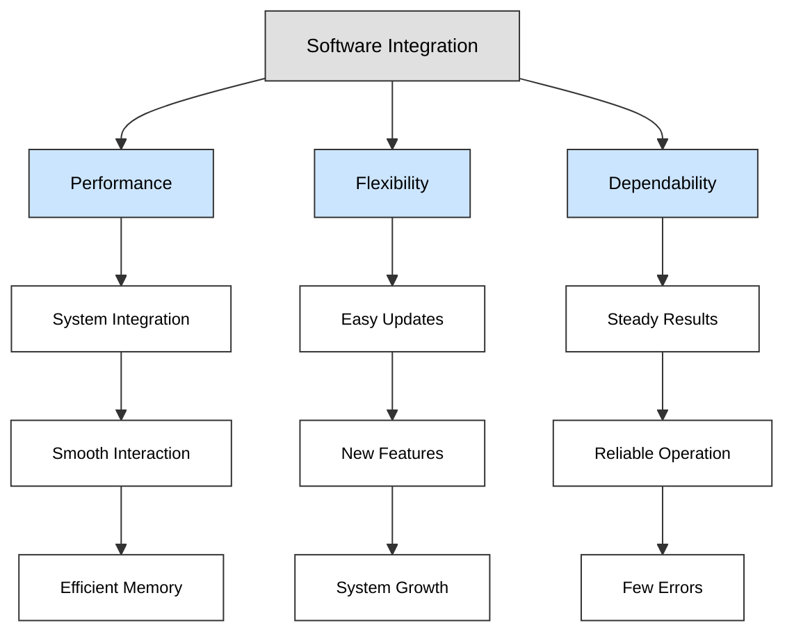

By: Zaynap Ahmad

# Integration Session

## Our Outlines:

1. System Components
2. Software Integration
3. Hardware - Software Integration
4. Hands-On Activity

## **1. System Components**

### System Overview

  

### Components Description

#### 1. Perception

- **Description:** Enables the robot to sense and interpret its environment.
- **Input:** Raw sensor data (e.g., camera images, LIDAR data)
- **Output:** Processed environmental data (e.g., detected objects, distance measurements)

#### 2. SLAM (Simultaneous Localization and Mapping)

- **Description:** Builds a map of the environment while tracking the robot's location.
- **Input:** Sensor data and motion data
- **Output:** Environment map and robot’s position

#### 3. Path Planning

- **Description:** Determines the optimal route from the current location to the destination.
- **Input:** Environment map and goal coordinates
- **Output:** Planned path (waypoints or trajectory)

#### 4. Control

- **Description:** Manages the robot's movements and actions based on the planned path and feedback.
- **Input:** Planned path and sensor feedback
- **Output:** Actuator commands (e.g., motor speeds, steering angles)

  

## **2. Software Integration**

### Why Integrate Software Components?

<!--  -->

