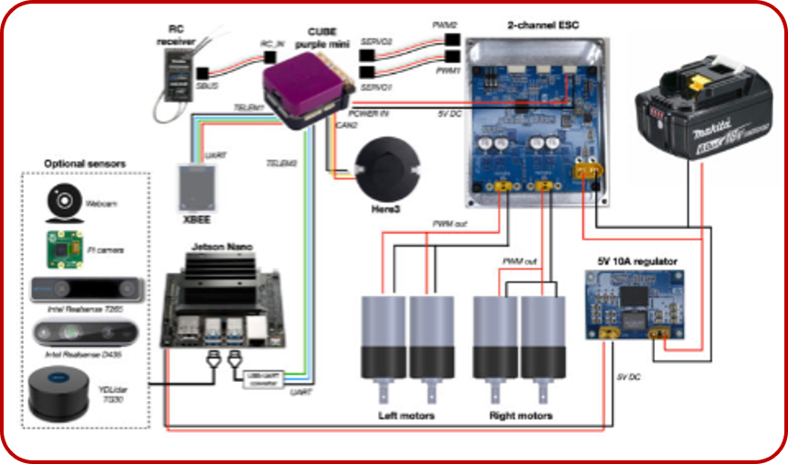

By: Zaynap Ahmad

# Integration Session

## Our Outlines:

* **robotic system archetecture**
* **System Components**
* **Software Integration**
* **Hardware - Software Integration**
* **Hands-On Activity**

## teleoperational vs autonomous robots

  

Teleoperational Robots are controlled directly by a human. The operator uses a remote control or a computer to send commands. This type of robot is often used in situations where it might be dangerous for a person to be present, like in bomb disposal or remote surgery. The operator must stay focused and react quickly, as they are responsible for every action the robot takes. However, teleoperational robots can be slower and have limitations in their speed and range due to the reliance on human control and the need for a stable communication link.

  

On the other hand,autonomous robtos  can operate on their own without human control. They use sensors to understand their environment and make decisions based on what they see. These robots can adapt to changes around them and do not need someone to guide them constantly. They are often used in applications like self-driving cars or robotic vacuum cleaners.
in this system i need the system it self to determine its action

### Key Differences

1. **Control**:

   - **Teleoperational Robots**: A human operates these robots by sending commands. The operator must pay close attention and be skilled. Because the robot relies on human input, it can be slower and may not react as quickly to changes.
   - **Autonomous Robots**: These robots can make decisions on their own and act without human control. They use sensors to understand their environment and can respond quickly to changes around them.
2. **Communication**:

   - **Teleoperational Robots**: They need a strong communication link with the operator. If the connection is lost, the robot might stop working or become hard to control. This limits how far away they can operate.
   - **Autonomous Robots**: They don’t need to communicate with a human to function. They process information and react to their surroundings independently, which gives them more freedom to move around.
3. **Software Complexity**:

   - **Teleoperational Robots**: The software is simpler and focuses on allowing the operator to control the robot easily. It doesn’t have to make complex decisions because a person is in charge.
   - **Autonomous Robots**: Their software is more complex, using advanced technology to help the robot see, think, and learn from its experiences.

## our system archetechure

  

### Components Description

#### 1. Perception

- **Description:** Enables the robot to sense and interpret its environment.
- **Input:** Raw sensor data (e.g., camera images, LIDAR data)
- **Output:** Processed environmental data (e.g., detected objects, distance measurements)

#### 2. SLAM (Simultaneous Localization and Mapping)

- **Description:** Builds a map of the environment while tracking the robot's location.
- **Input:** Sensor data and motion data
- **Output:** Environment map and robot’s position

#### 3. Path Planning

- **Description:** Determines the optimal route from the current location to the destination.
- **Input:** Environment map and goal coordinates
- **Output:** Planned path (waypoints or trajectory)

#### 4. Control

- **Description:** Manages the robot's movements and actions based on the planned path and feedback.
- **Input:** Planned path and sensor feedback
- **Output:** Actuator commands (e.g., motor speeds, steering angles)

### this how the whole system work but how the system repspond to the environment by any sequance ?

The relationship between the computational requirements for coming up with an an appropriate response to a given environmental challenge and the time allowed by the circumstances is at the heart of designing robot architectures

### sort of archetectures allow for timely response across environment ?

Murphy(2000) describes the range of current architectures (or  *paradigms* ) in terms of the relationships between three primitives,  *sense* , *plan* and *act* and in terms of how sensory data is processed and propagated through the system.

  

### hierarchical appraoch :

he *hierarchical paradigm* is a bit of a caricature. It was however the dominant paradigm in the early days of AI robotics when much of the focus was on robot planning. The emphasis in these early systems was in constructing a detailed world model and then carefully planning out what steps to take next. The problem was that, while the robot was constructing its model and deliberating about what to do next, the world was likely to change. So these robots exhibited the odd behavior that they would look (acquire data, often in the form of one or more camera images), process and plan, and then (often after a considerable delay) they would lurch into action for a couple of steps before beginning the cycle all over again. [Shakey](http://www.frc.ri.cmu.edu/~hpm/book98/fig.ch2/p027.html) a robot developed at the Stanford Research Institute in the 1970s was largely controlled by a remote computer connected to the robot by a radio link; Shakey exhibited this sort of look-and-lurch behavior as it contemplated moving blocks around to achieve a goal

  

  

### Reactive Systems

An alternative to the hierarchical paradigm with its horizontally organized architecture is called the *reactive paradigm* and is labeled as such above. Adherents of the reactive paradigm organize the components vertically so that there is a more direct route from sensors to effectors.

  

Note that in this vertical decomposition there is the potential for contention over the effectors. Just as in the example of steering a car to exit from the highway while avoiding an accident with the car in the lane to your right, there is contention among the various components, avoiding, exploring, wandering, planning, for taking control of the robots actuators. Brooks suggests that we solve the problem of contention by allowing components at one level to *subsume* components at a lower level. Thus he called his approach the  ***subsumption architecture*** .

In the subsumption architecture, components behaviors are divided into layers with an arbitration scheme whereby behaviors at one level can manipulate what behaviors at a lower level can see or do. Brooks called the most primitive components of his architecture  *modules* . Each module has inputs, outputs and a reset. A module at a higher level can suppress the input of a module at a lower level thereby preventing the module from seeing a value at its input. A module can also inhibit the output of a module at a lower level thereby preventing that output from being propagated to other modules.

The modules are meant to be simple computationally and so it is reasonable to think of them as circuits or finite state-machines. Brooks assumed that they were augmented finite state controllers. The reset would cause the controller to return to its initial state. Once set in motion the controllers would continuously transition from one state to the next. The transitions can be determined in part by reading from the inputs and some internal state and of course by referring to the present state of the controller. Brooks also allows controllers to have an internal clock or timer and so, for example, they can execute a wait. Here are the basic transition types allowed in specifying the transition function of a finite-state controller.

* **Output** - a transition can compute a value as a function of the module's inputs and internal state and then send the value to one of its outputs before entering a specified state
* **Side effect** - a transition can set one of the module's instance variables (internal state) to some value computed as a function of the module's inputs and internal state; the module then enters a specified state
* **Conditional dispatch** - a predicate on the module's inputs and instance variables is evaluated and depending on the outcome the module enters one of two specified states
* **Event dispatch** - a sequence of conditions and states to branch to is specified; the conditions are then monitored continuously until a condition is met and then the module transitions to the corresponding state

  

### hybrid archetecute :

think and act independantly and concerntly , its a combination of reactive and delibrative

its called the three layerd system (reactive layer , delibretive layer , middle layer )

  

### The Importance of Integration

We've explored the different architectures for robot control, from the slow and deliberate hierarchical approach to the fast and reactive approach. But there's a key concept that ties them all together: integration.

As Rodney Brooks famously said, **"Robotics is the art of integration."**   A robot is not simply a collection of parts – it's a complex system where hardware, software, sensors, and actuators all work together seamlessly. The success of a robot hinges on how well these elements are integrated.

Integration is crucial for several reasons:

* **Efficiency**: A well-integrated system allows for smooth information flow between components, leading to faster response times and efficient operation.
* **Performance**: When everything works together in harmony, the robot can perform its tasks more accurately and reliably.
* **Flexibility:** Modular and well-integrated systems can be easily adapted to new tasks or environments by adding or replacing components.
* **Scalability**: Integration allows for building complex robots with many functionalities by seamlessly integrating additional components

<!--  -->

#### two main steps in integration :

* software integration
* hardware - software integration

## software integration

> **to integrate the software components there are many archetectures to use**

**Software architecture** is the high-level structure of a software system, defining how components are organized and interact with each other. In the context of robotics, the software architecture plays a crucial role in determining how different software modules are integrated to control the robot's behavior.

image for (software arch)

### the most used  appraches for robotics  :

### Object-Oriented Robotics (OO-R)

**Object-Oriented Robotics (OO-R)** is a design paradigm that applies object-oriented programming (OOP) principles to the development of robotic systems. The focus of OO-R is on creating modular, reusable, and maintainable components that can interact with each other effectively. This approach offers several advantages in the design and implementation of robotic systems.

[example of software archetecture with OO-R](codes/OO-R_psudeoCode.py)

### Component-Based Robotics (CB-R)

**Component-Based Robotics (CB-R)** is an architectural approach that focuses on building robotic systems using interchangeable and reusable components. This methodology emphasizes modular design, where each component encapsulates specific functionality and can communicate with other components through well-defined interfaces. CB-R enhances flexibility, scalability, and maintainability in robotics development.

[example of software archetecture with CB-R](codes/CB-R_psudeoCode.py)

chart

### Service-Driven Robotics (SD-R)

**Service-Driven Robotics (SD-R)** is an architectural paradigm that focuses on building robotic systems as collections of services that can be independently developed, deployed, and consumed. This approach emphasizes the use of services as discrete units of functionality, promoting interoperability and scalability in robotic applications.

[example of software archetecture with SB-R](codes/SB-R_psudeoCode.py)

chart

after understanding what are the archetectures we could use to build the software , there are frameworks helps us to do this

### Frameworks

  

**Frameworks** are reusable software platforms that provide a foundation for building applications. They offer pre-built components, tools, and guidelines to streamline the development process and enhance code quality. In the field of robotics, frameworks play a crucial role in simplifying the development of complex software systems.

**Key benefits of using frameworks in robotics:**

* **Efficiency:** Frameworks provide pre-built components and tools, saving development time and effort.
* **Modularity:** Frameworks often promote modular design, making it easier to manage and maintain code.
* **Standardization:** Frameworks can establish common standards and conventions, improving code readability and maintainability.
* **Community Support:** Many frameworks have active communities that provide resources, documentation, and support.

### frameworks used in robotics :

| Framework                 | Overview                                                 | Key Features                                             | Architecture Type                | Use Cases                                   |
| ------------------------- | -------------------------------------------------------- | -------------------------------------------------------- | -------------------------------- | ------------------------------------------- |
| **ROS**             | Open-source robot software framework                     | Modular design, extensive libraries, strong community    | Component-based                  | Research, prototyping, complex systems      |
| **ROS 2**           | Enhanced successor to ROS for real-time applications     | Improved communication, security, multi-platform support | Component-based, Service-based   | Industrial applications, autonomous systems |
| **OpenRTM-aist**    | Framework for robot system integration                   | Real-time operations, easy component integration         | Component-based                  | Academic research, complex systems          |
| **Webots**          | Robot simulation software                                | User-friendly, extensive API                             | OOP (Object-oriented)            | Education, testing, prototyping             |
| **Choreonoid**      | Flexible robotics simulation framework                   | Component-based, supports motion planning                | Component-based                  | Research, prototyping, testing              |
| **CoppeliaSim**     | Versatile robot simulation environment                   | Integrated simulation, Lua scripting                     | OOP, Scripting                   | Algorithm development, testing              |
| **OpenAI Gym**      | Toolkit for reinforcement learning algorithms            | Environment integration                                  | Modular, API-driven              | Reinforcement learning applications         |
| **MATLAB/Simulink** | High-level control system programming                    | Block diagram environment, extensive toolboxes           | Block-based (Visual programming) | Prototyping, simulations                    |
| **ROS for Windows** | ROS version adapted for Windows                          | Windows compatibility, easier integration                | Component-based                  | Windows-based robotic software              |
| **RoboDK**          | Simulation and offline programming for industrial robots | Easy integration with multiple languages                 | OOP, API-driven                  | Industrial robot programming, simulation    |

## ROS2

finished the software lets put our software into work

## embedded boards used in robotics

## hardware - software integration

  

