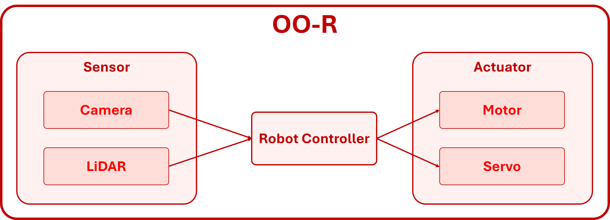
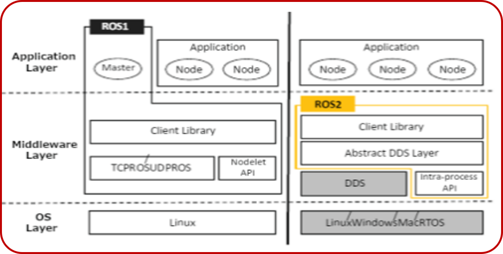

# Integration Session

As we embark on this integration session of our autonomous systems workshop, we'll focus on the exciting journey of transforming theoretical concepts into practical applications. This session will guide you through the process of assembling a fully autonomous robot, building on the pieces we've previously discussed.

While this guide is designed for students, professionals, and robotics enthusiasts alike, having prior knowledge of autonomous system concepts will enhance your experience. Our goal is to inspire creativity and curiosity, equipping you with the tools to navigate the dynamic world of autonomous robotics.

> It will be beneficial to have a solid understanding of these concepts as we delve deeper into implementation!

---

### About the instructor

👋 Hi! I'm **[Zaynap Ahmad](https://github.com/zaynabahmad)**

* 🎓 Mechatronics Level 300
* 🧠  autonomous member (Motion Planning) 23-24
* 🤖 Technical director 24-25
* 🔗Contact me: [LinkedIn](https://www.linkedin.com/in/zaynap-ahmad-a833b324a/)

---

### Today's Content

* **robotic system archetecture**
* **System Components**
* **Software Integration**
* **Hardware - Software Integration**

---

## teleoperational vs autonomous robots

  

**Teleoperational Robots** are directly controlled by a human operator who uses a remote control or computer to send commands. This type of robot is often deployed in high-risk environments, such as **bomb disposal** or **remote surgeries.** The operator must maintain focus and react swiftly, as they are **responsible for every action the robot takes.** However, teleoperational robots can be **slower** and have **limitations in speed and range** due to their reliance on human control and the necessity for a stable communication link.

  

In contrast, **Autonomous Robots** can operate independently without human intervention. They leverage sensors to perceive their environment and make real-time decisions based on their observations. These robots can adapt to changes in their surroundings, making them ideal for applications like self-driving cars and robotic vacuum cleaners. In this system, **the robot itself determines its actions based on the information it gathers.**

### Key Differences

1. **Control**:

   - **Teleoperational Robots**: Operated by humans who send commands, requiring close attention and skill. Their reliance on human input can slow reaction times and limit responsiveness to environmental changes.
   - **Autonomous Robots**: Make decisions independently, using sensors to understand and respond to their surroundings quickly.
2. **Communication**:

   - **Teleoperational Robots**: Depend on a strong communication link with the operator; if this connection is lost, the robot may halt or become difficult to control, limiting operational range.
   - **Autonomous Robots**: Function independently without the need for human communication, processing information and reacting to their environment autonomously, allowing greater freedom of movement.
3. **Software Complexity**:

   - **Teleoperational Robots**: Utilize simpler software focused on enabling effective human control, without the need for complex decision-making processes.
   - **Autonomous Robots**: Feature advanced software that facilitates perception, decision-making, and learning, enabling them to adapt and improve over time.

***This foundational understanding of teleoperational and autonomous robots will set the stage for our exploration of how to integrate these concepts into real-world applications. Let’s dive in!***

## our system archetechure

  

### Components Description

#### 1. Perception

- **Description** : This component enables the robot to sense and interpret its environment, providing critical information for decision-making.
- **Input** : Raw sensor data (e.g., camera images, LIDAR data)
- **Output**: Processed environmental data (e.g., detected objects, distance measurements)

#### 2. SLAM (Simultaneous Localization and Mapping)

- **Description**: SLAM builds a map of the environment while simultaneously tracking the robot's position within that map, allowing for accurate navigation.
- **Input**: Sensor data and motion data
- **Output** : An updated environment map and the robot’s current position

#### 3. Path Planning

- **Description** : This component determines the optimal route from the robot's current location to its intended destination, considering obstacles and environmental factors.
- **Input**: Environment map and goal coordinates
- **Output** : A planned path consisting of waypoints or trajectory

#### 4. Control

- **Description** : The Control component manages the robot's movements and actions based on the planned path and real-time feedback from sensors, ensuring smooth operation.
- **Input** : Planned path and sensor feedback
- **Output**: Actuator commands (e.g., motor speeds, steering angles)

---

***This how the whole system work but how the system repspond to the environment by any sequance ?***

### System Response to Environmental Challenges

Understanding how the system responds to environmental challenges is crucial. The balance between the computational requirements needed to formulate an appropriate response and the time constraints posed by the circumstances is at the core of designing effective robot architectures.

### Architectures for Timely Responses

Murphy (2000) discusses various robotic architectures—or paradigms—in her book (introduction to AI robotics ) that illustrate the interplay between three fundamental actions: **sense** , **plan** , and **act** . These paradigms define how sensory data is processed and propagated throughout the system, shaping how robots interact with their environments and respond to challenges.

  

### hierarchical appraoch :

  

The *hierarchical paradigm* was historically dominant in AI robotics, emphasizing detailed world modeling and sequential planning. While effective in structured environments, this approach often faced challenges. As the robot constructed its model and deliberated on its next steps, the external environment would likely change, resulting in a behavior known as "look-and-lurch." A notable example is  *Shakey* , a robot developed at the Stanford Research Institute in the 1970s, which was controlled by a remote computer and exhibited this behavior while attempting to manipulate blocks.

  

### Reactive Systems

In contrast, the *reactive paradigm* organizes components vertically, providing a more direct path from sensors to effectors. This approach facilitates quicker responses to environmental stimuli, enhancing the robot’s adaptability.

  

However, this vertical organization introduces potential contention over the effectors. For instance, when steering a car, multiple components—like avoiding an obstacle or exploring—may compete for control over the robot's actuators. To address this, Brooks introduced the **subsumption architecture**, which allows higher-level components to subsume lower-level ones.

In this architecture, behaviors are organized into layers with an arbitration scheme, enabling higher-level modules to inhibit the inputs and outputs of lower-level modules. The most basic components, termed modules, possess inputs, outputs, and reset capabilities, facilitating smooth transitions between states based on sensor input and internal conditions.

These modules can be thought of as simple computational units, akin to circuits or finite state machines, that continuously transition between states based on environmental feedback.

  

### hybrid archetecute :

A more recent development in robotic design is the hybrid architecture, which seeks to integrate the strengths of both reactive and deliberative paradigms. This three-layered system comprises a reactive layer, a deliberative layer, and a middle layer that coordinates between the two.

In this architecture, the reactive layer allows for quick responses to immediate stimuli, while the deliberative layer enables longer-term planning and strategy development. The middle layer acts as a mediator, ensuring that the system can think and act independently and concurrently, striking a balance between rapid reaction and thoughtful decision-making.

  

***By understanding these architectural paradigms, we can better design systems that effectively respond to dynamic environments, enhancing the capabilities and reliability of autonomous robots.***

---

### The Importance of Integration

We've explored the different architectures for robot control, from the slow and deliberate hierarchical approach to the fast and reactive approach. But there's a key concept that ties them all together: integration.

As Rodney Brooks famously said, **"Robotics is the art of integration."**   A robot is not simply a collection of parts – it's a complex system where hardware, software, sensors, and actuators all work together seamlessly. The success of a robot hinges on how well these elements are integrated.

#### Integration is crucial for several reasons:

- **Efficiency**: A well-integrated system ensures smooth information flow between components, leading to faster response times and more efficient operations. This seamless communication allows the robot to act quickly and accurately in dynamic environments.
- **Performance**: When all components work in harmony, the robot can perform its tasks with greater precision and reliability. Effective integration minimizes errors and enhances the overall functionality of the system.
- **Flexibility:**: Modular and well-integrated systems can be easily adapted to new tasks or environments. By adding or replacing components, robots can evolve to meet changing requirements, making them versatile in a variety of applications.
- **Scalability**: Integration facilitates the development of complex robots with diverse functionalities. By seamlessly incorporating additional components, we can enhance the robot's capabilities without compromising its performance.

  

---

### two main steps in integration :

To achieve effective integration in robotic systems, we focus on two main steps:

* **software integration:** This step involves ensuring that various software components work together seamlessly. It encompasses integrating algorithms for perception, planning, and control, as well as establishing communication protocols between different software modules. Effective software integration allows for real-time data processing and decision-making, enabling the robot to respond appropriately to environmental changes.
* **hardware - software integration:** This step focuses on the alignment between hardware components (sensors, actuators, and processors) and the software that drives them. It involves configuring the hardware to accurately interpret sensor data and translate software commands into physical actions. Successful hardware-software integration ensures that the robot operates efficiently and reliably, with minimal latency between sensing, processing, and acting.

## software integration

> **to integrate the software components there are many archetectures to use**

**Software architecture** refers to the high-level structure of a software system, defining how components are organized and how they interact with each other. In the context of robotics, the software architecture is crucial for determining how different software modules are integrated to control the robot's behavior effectively.

image for (software arch)

### the most used  appraches for robotics  :

### Object-Oriented Robotics (OO-R)

**Object-Oriented Robotics (OO-R)** applies object-oriented programming (OOP) principles to the development of robotic systems. This design paradigm emphasizes creating modular, reusable, and maintainable components that can effectively interact with one another. OO-R offers several advantages, including improved code organization and the ability to easily extend functionalities.s

[example of software archetecture with OO-R](codes/OO-R_psudeoCode.py)

  

### Component-Based Robotics (CB-R)

**Component-Based Robotics (CB-R)** focuses on constructing robotic systems using interchangeable and reusable components. This methodology emphasizes modular design, where each component encapsulates specific functionality and communicates with other components through well-defined interfaces. CB-R enhances flexibility, scalability, and maintainability in robotics development.

[example of software archetecture with CB-R](codes/CB-R_psudeoCode.py)

  

### Service-Driven Robotics (SD-R)

**Service-Driven Robotics (SD-R)** is an architectural paradigm that focuses on building robotic systems as collections of services that can be independently developed, deployed, and consumed. This approach emphasizes using services as discrete units of functionality, promoting interoperability and scalability in robotic applications.

[example of software archetecture with SB-R](codes/SB-R_psudeoCode.py)

  

after understanding what are thAfter understanding the various architectures available for building software, we can leverage frameworks that facilitate this process. These frameworks provide pre-defined structures and tools that streamline development, ensuring that our software components can be integrated efficiently and effectively.e archetectures we could use to build the software , there are frameworks helps us to do
this

---

### Frameworks

  

**Frameworks** are reusable software platforms that provide a foundation for building applications. They offer pre-built components, tools, and guidelines to streamline the development process and enhance code quality. In the field of robotics, frameworks are essential for simplifying the development of complex software systems and can include frameworks for applications, middleware, simulation, and more.

**Key benefits of using frameworks in robotics:**

* **Efficiency:** Frameworks provide pre-built components and tools, saving development time and effort.
* **Modularity:** Frameworks often promote modular design, making it easier to manage and maintain code.
* **Standardization:** Frameworks can establish common standards and conventions, improving code readability and maintainability.
* **Community Support:** Many frameworks have active communities that provide resources, documentation, and support.

### frameworks used in robotics :

| Framework                 | Overview                                                        | Key Features                                             | Architecture Type                | Use Cases                                     |
| ------------------------- | --------------------------------------------------------------- | -------------------------------------------------------- | -------------------------------- | --------------------------------------------- |
| **ROS**             | Open-source robot software framework                            | Modular design, extensive libraries, strong community    | Component-based                  | Research, prototyping, complex systems        |
| **ROS 2**           | Enhanced successor to ROS for real-time applications            | Improved communication, security, multi-platform support | Component-based, Service-based   | Industrial applications, autonomous systems   |
| **OpenRTM-aist**    | Framework for robot system integration                          | Real-time operations, easy component integration         | Component-based                  | Academic research, complex systems            |
| **Webots**          | Robot simulation software                                       | User-friendly, extensive API                             | OOP (Object-oriented)            | Education, testing, prototyping               |
| **Choreonoid**      | Flexible robotics simulation framework                          | Component-based, supports motion planning                | Component-based                  | Research, prototyping, testing                |
| **CoppeliaSim**     | Versatile robot simulation environment                          | Integrated simulation, Lua scripting                     | OOP, Scripting                   | Algorithm development, testing                |
| **OpenAI Gym**      | Toolkit for reinforcement learning algorithms                   | Environment integration                                  | Modular, API-driven              | Reinforcement learning applications           |
| **MATLAB/Simulink** | High-level control system programming                           | Block diagram environment, extensive toolboxes           | Block-based (Visual programming) | Prototyping, simulations                      |
| **ROS for Windows** | ROS version adapted for Windows                                 | Windows compatibility, easier integration                | Component-based                  | Windows-based robotic software                |
| **RoboDK**          | Simulation and offline programming for industrial robots        | Easy integration with multiple languages                 | OOP, API-driven                  | Industrial robot programming, simulation      |
| **YARP**            | Yet Another Robot Platform for communication between components | Real-time inter-process communication                    | Middleware                       | Robotics applications with complex components |
| **Carmen**          | Framework for robot control and simulation                      | Support for various sensor types, easy integration       | Component-based                  | Research, mobile robot applications           |
| **Player/Stage**    | Robot device interface and simulation environment               | Allows control of physical robots and simulated robots   | Client-server architecture       | Multi-robot systems, research, education      |

***These frameworks provide valuable tools and structures that facilitate the development and integration of robotic systems, ensuring that developers can focus on creating innovative solutions while benefiting from established best practices.***

## ROS2

finished the software lets put our software into work

### what is ROS ?

The acronym ROS stands for Robot Operating System. It is important to clarify that ROS is not a traditional operating system that replaces Linux or Windows; rather, it serves as middleware that enhances the capabilities of robotic applications. The "2" in ROS 2 indicates that it is the second generation of this middleware.

Robot Operating System (ROS) consists of a suite of open-source algorithms, hardware drivers, and tools designed to facilitate the development of robot control software. Despite its name, it is fundamentally:

* **A Communication System**  (including Publish-Subscribe and Remote Method Invocation)
* A set of **Frameworks & Tools** (for building systems, managing dependencies, visualization, recording, and replaying data)
* **An Ecosystem**  that includes language bindings, drivers, libraries, and simulation tools (like Gazebo)

#### Currently, ROS exists in two generations: ROS1 and ROS2.

* **ROS1** was primarily used for education and academic research.
* **ROS2** is tailored for commercial robots.

ROS offers mature libraries for various functions, including navigation, control, motion planning, vision, and simulation. Notably, RViz is a key visualization tool used with ROS, while Gazebo serves as a vital simulation tool for developers. Additionally, the OpenCV library is utilized for detection purposes in ROS 2.

  

## ROS 2 Architecture

ROS 2 features a distributed real-time system architecture. Various components, such as sensors, motion controllers, detection algorithms, artificial intelligence, and navigation algorithms, are represented as nodes within this architecture. The DDS middleware chosen for ROS 2 facilitates data exchange and communication among these nodes in a distributed environment.

### different between ros1 and ros2

  

#### Key differences between ROS1 and ROS2 include:

* **Operating System Support**: ROS1 primarily supports Linux, while ROS2 enhances portability across various operating systems, including Linux, Windows, macOS, and Real-Time Operating Systems (RTOS).
* **Communication Protocols**: ROS1 utilizes TCPROS/UDPROS, relying heavily on the Master node. In contrast, ROS2 employs DDS (Data Distribution Service), which improves fault tolerance and independence from a single Master node.
* **Intra-process Communication**: ROS2 offers a more optimized transmission mechanism for intra-process communication.

### ROS2 has three main dimentions

#### The Community:

The ROS community is vital for developing applications using this middleware. In addition to providing technical documentation, it boasts a vast network of developers who contribute applications and utilities through public repositories. Often, community members have already created tools or solutions that can be beneficial to others.

#### Computation Graph:

The Computational Graph is a fundamental aspect of a running ROS 2 application. This graph consists of nodes (the primary computing units in ROS 2) and arcs (connections between nodes). Nodes can collaborate through various communication paradigms, enabling the composition of complex applications. Monitoring tools, also represented as nodes, are integrated within this graph.

#### The Workspace:

The Workspace encompasses all software installed on the robot or computer, as well as user-developed programs. Unlike the dynamic nature of the Computational Graph, the Workspace is static and also includes the development tools necessary to build the components of the graph.

***we will proceed with the comoutaion graph***

#### how the node could talk to each other :

Nodes in ROS 2 communicate with one another through three primary paradigms:

#### Publication/Subscription:

This is an asynchronous communication mechanism where multiple nodes (N) publish messages to a topic, which can be subscribed to by other nodes (M). A topic acts as a communication channel for messages of a specific type. This paradigm is widely used in ROS 2; for instance, a camera driver node publishes images to a topic that other nodes subscribe to for processing.

image

[example of publisher and subscriber method ](codes/publisher_subscriber.py)

#### Services:

This is an asynchronous communication method where a node requests another node and expects an immediate response. This is crucial for maintaining control cycles without significant delays. For example, a mapping service node may reset a map and respond to the request.

image

[example of services method ](codes/services.py)

#### Actions:

Actions allow asynchronous communication where one node requests another node to perform a task that may take time. The calling node can receive periodic feedback or notifications regarding the status of the action. An example would be a navigation request that doesn't block the requesting node while it waits for completion.

image

<<<<<<< HEAD
code example
============

[example of actions method ](codes/actions.py)

>>>>>>> ec45e2928d6252f72e84b3f0eb30a689d2ba63c7
>>>>>>>
>>>>>>
>>>>>
>>>>
>>>
>>

### this how the nodes could talk to each other but how the node actually works ?

Nodes in a computational graph perform processing or control, functioning as active elements with two primary execution models:

#### Iterative execution:

In this model, nodes execute their control cycles at a specific frequency, allowing precise control over resource usage and consistent output flow. For instance, a node calculating motion commands for actuators at 20 Hz based on sensor status exemplifies this approach.

code examble and image

[example of iterative execution method ](codes/iterative.py)

#### Event-oriented execution:

In this model, node execution is triggered by the arrival of specific events, such as messages. For instance, a node that processes each incoming image and performs detection based on the frequency of message arrivals illustrates this execution style.

code example and image
<<<<<<< HEAD
============

[example of event oriented  method ](codes/event_oriented.py)

>>>>>>> ec45e2928d6252f72e84b3f0eb30a689d2ba63c7
>>>>>>>
>>>>>>
>>>>>
>>>>
>>>
>>

### layed archetecture

  

### DDS

DDS (Data Distribution Service) is a middleware protocol used for real-time data exchange between distributed systems. In the context of ROS 2, it enables different components (or nodes) of a robot to communicate effectively.

ROS 2 has provided its own abstraction layer (rmw) on top of DDS instead of directly using the DDS middleware. Thus, the details of the DDS middleware interface are abstracted from the user.  =In the current ROS 2 versions, Fast-DDS comes as the standard DDS version

  

Overall, DDS enhances the communication capabilities of ROS 2, making it suitable for complex robotic applications.

### ROS2 client library

ROS 2 applications access ROS 2 features through the ROS Client Library (RCL) client library. The Rcl library is written in C language and on it there are Rclcpp client libraries for C ++ language and Rclpy for Python language. There are independently written ROS 2 client libraries in other languages such as Java, Go. The client library is primarily provided with the standard interface required to exchange data with Topic and Service approaches over ROS 2. In addition, the ROS2 library has capabilities to provide operating system abstraction and ready-made micro-architectural structures.

  

---

<<<<<<< HEAD
============

### embedded boards used in robotics

When designing robotic systems, selecting the right embedded board is crucial. Here’s a comparison of three common types: microcontroller-based, microprocessor-based, and System on Chip (SoC).

| Feature                                 | Microcontroller-Based Boards                                    | Microprocessor-Based Boards                          | System on Chip (SoC)                                                 |
| --------------------------------------- | --------------------------------------------------------------- | ---------------------------------------------------- | -------------------------------------------------------------------- |
| **Processing Power**              | Low to moderate (8-32 MHz)                                      | Moderate to high (1-4 GHz)                           | High (up to 2 GHz and above)                                         |
| **Memory**                        | Limited (2-256 KB RAM)                                          | Moderate to high (1-8 GB RAM)                        | Integrated memory (1-8 GB RAM)                                       |
| **Operating System**              | No OS (bare-metal programming)                                  | Typically runs a full OS (Linux)                     | Can run a full OS or RTOS                                            |
| **Cost**                          | Generally low ($5-$30)                                          | Moderate to high ($30-$200)                          | Varies, generally moderate to high ($50-$200)                        |
| **Examples**                      | Arduino Uno (e.g., simple robot)                                | Raspberry Pi 4 (e.g., robotic arm)                   | NVIDIA Jetson Nano (e.g., autonomous drone)                          |
| **Supporting ROS**                | Limited support, basic functionalities                          | Good support, full ROS capabilities                  | Excellent support, optimized for ROS applications                    |
| **Typical Use Cases in Robotics** | Simple robots, sensor interfacing (e.g., line-following robots) | Complex robots, computer vision (e.g., robotic arms) | Autonomous robots, drones, AI applications (e.g., self-driving cars) |

### some importatn concepts

### Input Peripherals

Input peripherals are essential for robots as they allow them to sense and gather information from their environment. These devices provide the necessary data that helps robots make informed decisions and react accordingly. Common input peripherals in robotics include:

- **Sensors**: Devices that detect physical properties. Examples include:
  - **Cameras**: Capture visual information, enabling object recognition and navigation through 2D or 3D images.
  - **LiDAR** (Light Detection and Ranging): Uses laser pulses to create accurate 3D maps of the environment, aiding in navigation and obstacle detection for autonomous systems.

### Output Peripherals

Output peripherals enable robots to take actions based on the information processed by the CPU. They help robots interact with their environment. Key output peripherals include:

- **Motors**: Convert electrical signals into motion. Examples include:

  - **Servo Motors**: Allow precise control of angular position, making them ideal for robotic arms and grippers.
  - **DC Motors**: Provide continuous rotation, commonly used for driving wheels in mobile robots.
- **Lights and Buzzers**: Used for signaling and feedback. Examples include:

  - **LEDs**: Indicate the operational status of the robot (e.g., powered on or in standby mode).
  - **Buzzers**: Emit sound alerts to notify users or indicate specific events.

### CPU (Central Processing Unit)

The CPU is the brain of the robot, responsible for processing data and executing commands. Key functions include:

- **Processing Power**: Determines how quickly the robot analyzes data and responds to changes, enabling complex calculations and multitasking.
- **Decision Making**: Interprets sensor data to control output peripherals, allowing the robot to navigate and perform tasks.
- **Task Management**: Handles multiple tasks simultaneously, essential for efficient operation.
- **Real-Time Processing**: Enables the robot to make quick decisions, critical for applications like autonomous driving.
- **Memory Usage**: Utilizes RAM for immediate tasks and storage for long-term data, allowing the CPU to manage complex programs effectively.

### Other Peripherals

Other peripherals enhance the robot's functionality and enable additional capabilities. These include:

- **Communication Modules**: Allow the robot to communicate with other devices or systems. Examples include:

  - **Wi-Fi Modules**: Enable internet connectivity for remote control or data sharing.
  - **Bluetooth Modules**: Facilitate short-range communication with smartphones or other devices.
- **Storage**: Components like SD cards or flash memory provide capacity to store data, such as sensor logs, configurations, or program files.
- **Power Supply**: Essential for powering all robot components, including batteries or external power sources for operational longevity.

### Choosing the Right Board

When selecting an embedded board, consider:

* **Application Requirements** : Analyze the complexity of tasks the robot will perform.
* **Processing Power Needed** : Determine whether low power (microcontroller) or high performance (microprocessor) is essential.
* **Cost Constraints** : Align board selection with your budget.
* **ROS Support** : Ensure compatibility with ROS if you're planning to use it for development.

---

### lets build our system

  

>>>>>>> ec45e2928d6252f72e84b3f0eb30a689d2ba63c7
>>>>>>>
>>>>>>
>>>>>
>>>>
>>>
>>

## hardware - software integration

  

## **references :**

4.https://medium.com/software-architecture-foundations/robot-operating-system-2-ros-2-architecture-731ef1867776
